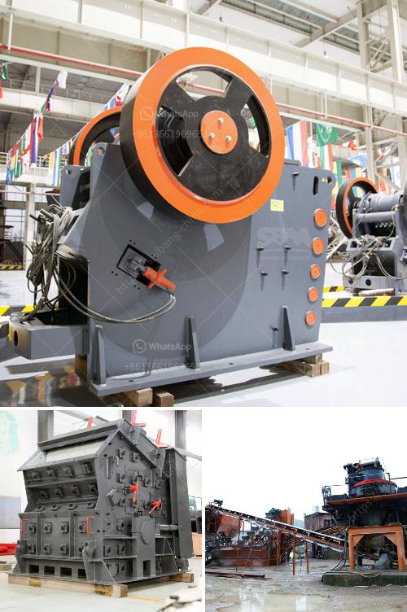

<h3>the cost of grinding machine in uganda</h3>
The cost of grinding machine in Uganda mainly depends on the type of machine and its specifications. With the rapid industrialization in Uganda, people are increasingly getting access to various machines that make their work easier. However, these machines come with a price and it is important for individuals and businesses to understand the cost implications before making a purchase.

The cost of grinding machines in Uganda varies based on the availability of the machines in the market and their specifications. For instance, a hand grinding machine in Uganda may cost around $15 or more, while a maize grinding mill machine in Uganda can cost up to $1,000 or more.

In rural areas, where electricity is not readily available, people prefer to use diesel-powered milling machines. These machines are more expensive compared to their electric counterparts and can range from $1,500 to $3,000 or even more. However, they provide a reliable and efficient way to grind grains such as maize, millet, and sorghum.

For commercial purposes, businesses might require larger grinding machines that can handle heavy workloads. These machines are more expensive and can cost up to $10,000 or more, depending on their specifications and the brand.

It is essential to consider various factors before investing in a grinding machine in Uganda. These include the purpose, workload, production capacity, and availability of spare parts. Additionally, buyers should research reputable suppliers and compare prices to ensure they get the best value for their investment.

In conclusion, the cost of grinding machines in Uganda can vary significantly depending on the type, specifications, and purpose of the machine. It is crucial for individuals and businesses to carefully assess their needs and budget before making a purchase. By doing so, they can acquire a grinding machine that meets their requirements and contributes to increased productivity and profitability.
<h3>Contact us</h3><ul><li><strong>Whatsapp:&nbsp;<a href="https://wa.me/8613661969651">+8613661969651</a></strong></li><li><a href="https://swt.shibang-china.com/?git&amp;zhl&amp;the cost of grinding machine in uganda"><strong>Online Service(chat now)</strong></a></li></ul><h3>Related</h3><ul><li><a href='sand washing machine lsx920.md'>sand washing machine lsx920</a></li><li><a href='wet process feldspar supplier.md'>wet process feldspar supplier</a></li><li><a href='ore processing plant for sale.md'>ore processing plant for sale</a></li><li><a href='brick making machines for sale in zimbabwe.md'>brick making machines for sale in zimbabwe</a></li><li><a href='marble granding machine price in india.md'>marble granding machine price in india</a></li></ul>