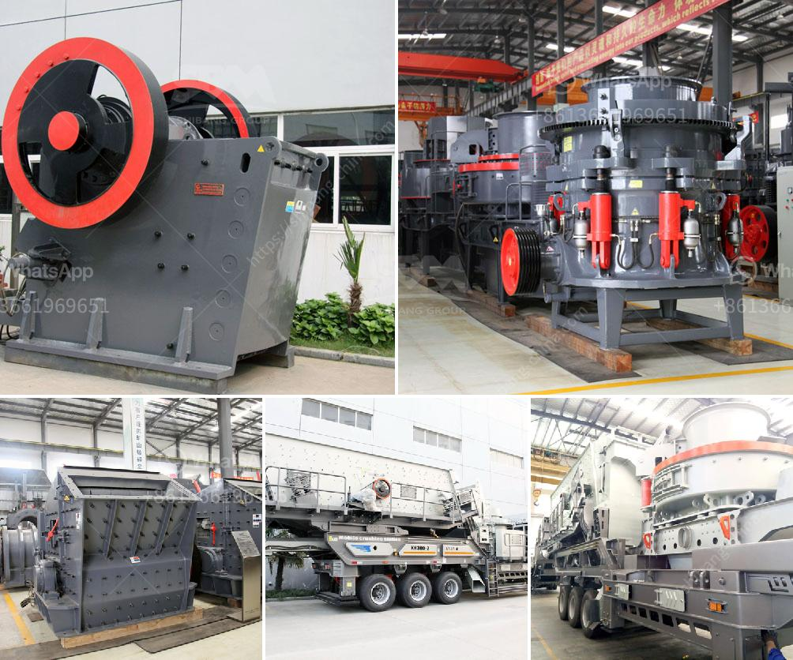

<h3>the crunch hand operated rock crusher</h3>
Are you tired of using traditional methods to break rocks and stones? Look no further! The Crunch Hand Operated Rock Crusher is the perfect solution to your rock and stone crushing needs. With its innovative design and guaranteed results, this efficient tool will save you both time and energy, allowing you to focus on what you do best.

The Crunch Hand Operated Rock Crusher is a portable and easy-to-use device that allows you to crush rocks effortlessly without any special training or skills needed. The device uses the power of your hand to apply pressure and forcefully break rocks into smaller, more manageable pieces.

One of the key features of the Crunch Hand Operated Rock Crusher is its ability to quickly and easily adjust the size of the output material. Whether you need gravel for your landscaping project or crushed stone for a construction site, this crusher can meet your requirements. Its built-in adjustability ensures you get the desired crushed material size with just a simple twist.

As the name suggests, this crusher is completely hand operated, eliminating the need for electricity or even batteries. This makes it the perfect tool for those working in remote or off-grid locations, where power supply may be limited. Its compact and lightweight design allows for easy transportation, so you can take it wherever you go.

The Crunch Hand Operated Rock Crusher is also built to last. Made with high-quality materials, it is durable and resistant to wear and tear. This ensures that you can rely on it for years to come, even under the most demanding conditions.

In conclusion, the Crunch Hand Operated Rock Crusher is a versatile and efficient tool designed to simplify your rock crushing tasks. With its adjustable output size and easy operation, it saves you time and effort, allowing you to focus on other aspects of your work. Whether you're a professional contractor or a DIY enthusiast, this crusher is a must-have addition to your toolkit. Invest in the Crunch Hand Operated Rock Crusher today and experience the benefits it brings to your rock crushing endeavors!
<h3>Contact us</h3><ul><li><strong>Whatsapp:&nbsp;<a href="https://wa.me/8613661969651">+8613661969651</a></strong></li><li><a href="https://swt.shibang-china.com/?git&amp;zhl&amp;the crunch hand operated rock crusher"><strong>Online Service(chat now)</strong></a></li></ul><h3>Related</h3><ul><li><a href='basalt production machinery.md'>basalt production machinery</a></li><li><a href='cement grinding station quotations.md'>cement grinding station quotations</a></li><li><a href='china raymond roller mills.md'>china raymond roller mills</a></li><li><a href='equipment used in small scale mining in ghana.md'>equipment used in small scale mining in ghana</a></li><li><a href='vertical vertical raw mill.md'>vertical vertical raw mill</a></li></ul>