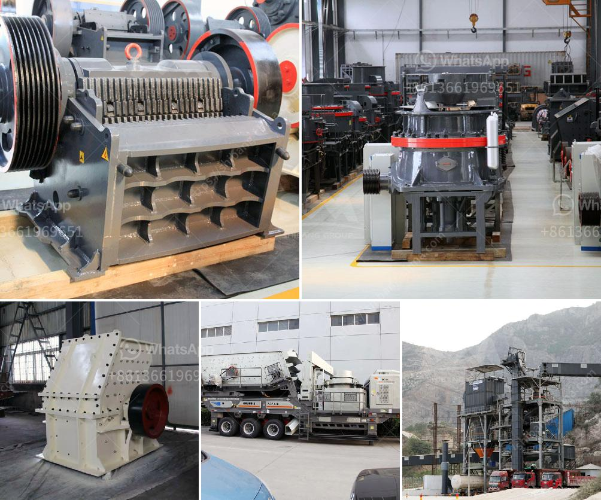

<h3>the price of a ball mill in india</h3>
The Ball Mill Price in India is competitive and affordable. Ball mills are grinders that are used to pulverize and blend materials for use in mineral dressing processes, paints, pyrotechnics, ceramics, and selective laser sintering. These machines are widely used in the mining industry, where they grind materials into smaller particles, making them suitable for further processing.

The price of a ball mill in India can vary depending on several factors, including the quality and availability of spare parts, the expertise and skill of the workforce, and the type of technology used to manufacture these machines. Additionally, the size and capacity of the ball mill also influence its price.

Ball mills are typically made of steel or rubber, and they consist of a hollow cylinder, which is mounted on a rotating horizontal axis. The cylinder is partially filled with the grinding medium, such as steel balls or ceramic balls, that move freely within the cylinder due to the rotation of the mill. As the mill rotates, the grinding media crushes and grinds the material fed into the mill, resulting in the desired particle size reduction.

In India, there are various ball mill manufacturers and suppliers who provide high-quality equipment at competitive prices. These mills are designed to handle different capacities, ranging from a few kilograms to several tons per hour. The price of a ball mill in India typically falls between INR 10,000 to INR 15,000.

Ball mills offered in India are often utilized for a secondary grinding process in conjunction with other crushing machinery. These machines offer an efficient method for achieving a high level of fineness for materials such as cement, clinker, limestone, and others. They can be used in either dry or wet grinding processes, making them versatile and suitable for various applications.

The cost of a ball mill in India also depends on the features and attachments provided with the machine. Some common features include automatic temperature control, adjustable grinding speed, and convenient operation. Additionally, certain ball mills may include advanced safety features to ensure the protection of workers.

When purchasing a ball mill in India, it is essential to consider factors such as after-sales service and warranty provided by the manufacturer or supplier. Additionally, it is crucial to evaluate the reputation and credibility of the supplier and check customer reviews and testimonials to ensure the quality and reliability of the product.

In conclusion, the price of a ball mill in India is competitive and affordable, depending on various factors such as the size, capacity, technology, and features provided with the machine. It is crucial to research and compare different suppliers to make an informed decision and choose a reliable and cost-effective option for your specific needs.
<h3>Contact us</h3><ul><li><strong>Whatsapp:&nbsp;<a href="https://wa.me/8613661969651">+8613661969651</a></strong></li><li><a href="https://swt.shibang-china.com/?git&amp;zhl&amp;the price of a ball mill in india"><strong>Online Service(chat now)</strong></a></li></ul><h3>Related</h3><ul><li><a href='automatic feeder for ball mill customer case.md'>automatic feeder for ball mill customer case</a></li><li><a href='grinding plant supplier.md'>grinding plant supplier</a></li><li><a href='stone crushing plant in saudi.md'>stone crushing plant in saudi</a></li><li><a href='granite quarry machinery for sale.md'>granite quarry machinery for sale</a></li><li><a href='crusher and screening plant.md'>crusher and screening plant</a></li></ul>