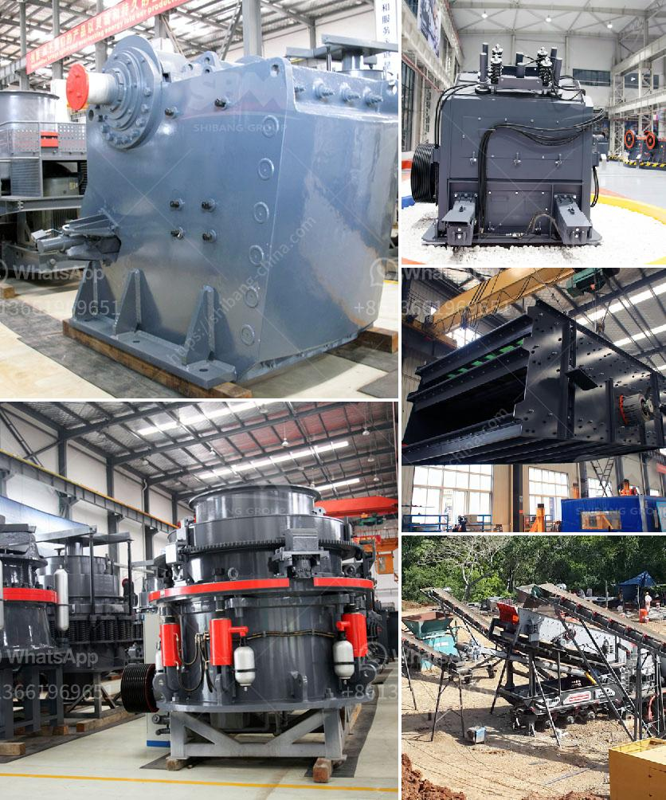

<h3>ton per hour gold wash plant</h3>
Gold mining is a lucrative industry that has been practiced for centuries. In recent years, advancements in technology have revolutionized the way gold is recovered and processed. One such innovation is the development of efficient wash plants capable of handling large volumes of material, ensuring higher gold yields in a shorter timeframe. This article delves into the benefits and features of a 1 ton per hour gold wash plant.

Traditional gold mining methods required miners to manually sift through dirt and gravel, a time-consuming process that limited production rates. However, with the introduction of wash plants, miners can now process larger volumes of material in a fraction of the time, significantly increasing their production yields.

A 1 ton per hour gold wash plant is an ideal solution for small-scale gold miners looking to drastically increase their gold recovery rates. These wash plants feature a trommel screen, with various wash zones, which enables the separation and recovery of fine gold particles from heavy clay, gravel, and stones.

1. High-Quality and Durable Construction: The wash plant is built with high-quality materials to ensure long-lasting performance in harsh mining environments. The use of robust steel frames and high-grade stainless steel screens and components guarantees durability and resistance to wear and tear.

2. Efficient Recovery System: The wash plant is equipped with a specially designed riffle system that creates turbulence in the water flow, allowing heavy gold particles to settle while light materials are efficiently washed away. Additionally, the wash plant is equipped with a series of sluice boxes and mats, specifically designed to capture fine gold particles.

3. Ease of Operation: The wash plant is designed to be user-friendly and requires minimal maintenance. The use of efficient water and power systems ensures that the plant operates smoothly with minimal interruptions, allowing miners to focus on their gold recovery efforts.

4. Portability and Mobility: The 1 ton per hour wash plant is designed to be easily transported to different mining sites. Its compact size and lightweight construction enable miners to move it to areas with high gold potential without much effort.

5. Modular Design: The wash plant is built using a modular design, making it versatile and customizable. Miners can add or remove certain components to suit their specific gold recovery needs or upgrade the plant as their mining operations expand.

With a 1 ton per hour gold wash plant, small-scale gold miners can maximize their production rates and achieve efficient gold recovery. The plant's efficient recovery system, ease of operation, and durability make it an excellent option for miners looking to increase their gold yields while minimizing operation costs.

This innovative technology not only enhances productivity but also reduces the environmental impact of traditional gold mining methods. With the continued development and improvement of wash plant technology, small-scale miners can now access equipment that was once only available to large-scale mining operations, facilitating sustainable growth and enhanced profitability in the gold mining industry.
<h3>Contact us</h3><ul><li><strong>Whatsapp:&nbsp;<a href="https://wa.me/8613661969651">+8613661969651</a></strong></li><li><a href="https://swt.shibang-china.com/?git&amp;zhl&amp;ton per hour gold wash plant"><strong>Online Service(chat now)</strong></a></li></ul><h3>Related</h3><ul><li><a href='hammer mill for limestone in south africa.md'>hammer mill for limestone in south africa</a></li><li><a href='marble production line germany.md'>marble production line germany</a></li><li><a href='crusher plants in kuwait.md'>crusher plants in kuwait</a></li><li><a href='equipment used in small scale mining in ghana.md'>equipment used in small scale mining in ghana</a></li><li><a href='crusher for limestone.md'>crusher for limestone</a></li></ul>