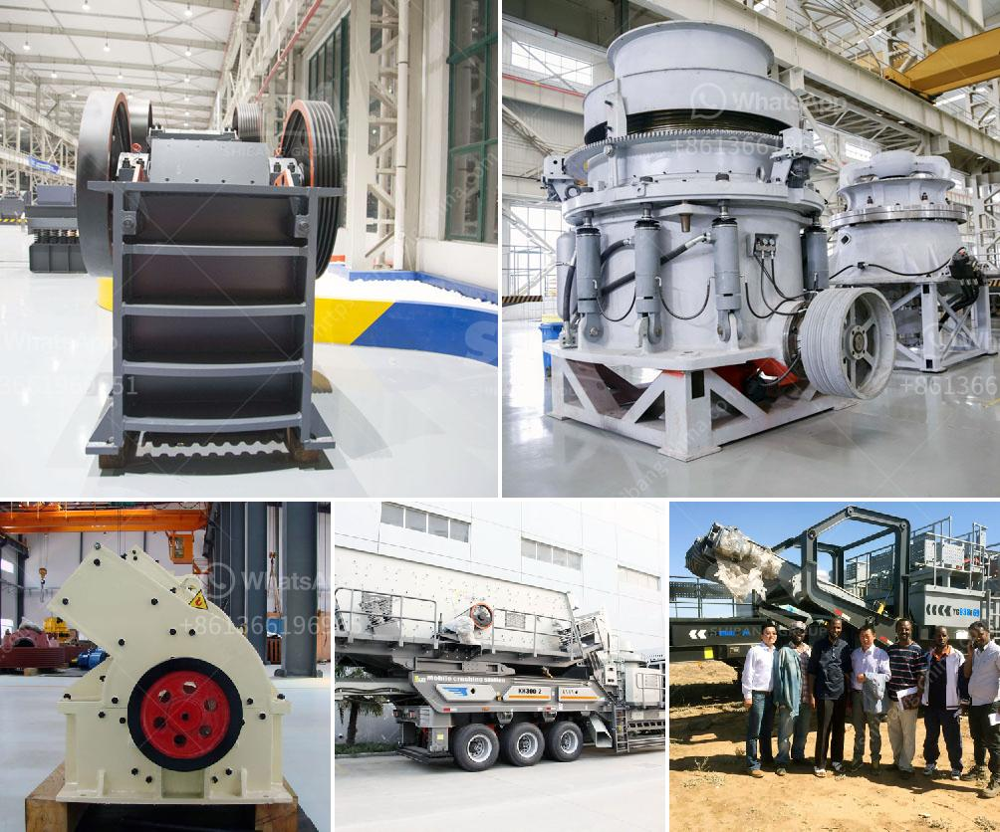

<h3>top 5 brands of stone crushers</h3>
Choosing the right equipment for your business can be a challenging task. With a multitude of options available, it's essential to consider several factors before making a decision. To help you make an informed choice, here are five top brands of stone crushers to consider.

Metso is a renowned manufacturer of crushing and screening equipment, established in 1868. Over the years, they have expanded their product range and expertise in the mining industry. Their crushers are used in mining, construction, and recycling applications. Their main goal is to deliver reliable, versatile, and high-performance machinery that meets customer needs. Metso crushers are known for their exceptional durability and efficiency, ensuring maximum productivity and reduced downtime.

Sandvik is another well-known brand in the crushing equipment industry. Their stone crushers are ideal for both small-scale and large-scale stone processing operations. The Sandvik range includes jaw crushers, cone crushers, and impact crushers- all providing high performance, reliability, and durability. Sandvik crushers are renowned for their excellent versatility, allowing them to produce a wide range of different end products efficiently.

Terex is a diversified global manufacturer of construction equipment, mining equipment, and various other products. Their crushers have been designed to cater to specific customer needs, whether it is crushing hard rocks, recycling materials, or other applications. Terex crushers combine high capacity with a compact design, producing remarkable efficiency without compromising on power. They are reliable and easy to maintain, ensuring a longer operational life.

McCloskey International specializes in designing and manufacturing innovative crushers targeted at the aggregates industry. Their equipment is renowned for its reliability, productivity, and fuel efficiency. McCloskey crushers are known for their unique features such as the ability to adjust the jaw settings for different materials and an intelligent control system to optimize production. With a wide range of models available, McCloskey crushers can handle any stone processing application.

RUBBLE MASTER is a relatively new player in the stone crushing equipment industry but has quickly gained a reputation for its compact crushers that deliver high performance. Their machines are highly flexible and can be used in various applications, including construction waste recycling and natural stone processing. RUBBLE MASTER crushers are known for their excellent fuel efficiency, reducing operating costs while maintaining high productivity and output.

In conclusion, choosing the right brand of stone crushers is crucial for maximizing productivity, minimizing downtime, and ensuring the long-term success of your business. Each of these top brands offers unique features and advantages, catering to different customer needs. Whether you require durability, versatility, fuel efficiency, or specific functionalities, there is a brand that can fulfill your requirements. Remember to consider factors such as capacity, power, maintenance, and the type of materials you need to process when selecting the right stone crusher brand for your business.
<h3>Contact us</h3><ul><li><strong>Whatsapp:&nbsp;<a href="https://wa.me/8613661969651">+8613661969651</a></strong></li><li><a href="https://swt.shibang-china.com/?git&amp;zhl&amp;top 5 brands of stone crushers"><strong>Online Service(chat now)</strong></a></li></ul><h3>Related</h3><ul><li><a href='cement plant layout consultants in south kolkata.md'>cement plant layout consultants in south kolkata</a></li><li><a href='sand washing plant price.md'>sand washing plant price</a></li><li><a href='business plan on manganese ore mining crusher.md'>business plan on manganese ore mining crusher</a></li><li><a href='buy roller crusher.md'>buy roller crusher</a></li><li><a href='packing plant in cement industry.md'>packing plant in cement industry</a></li></ul>