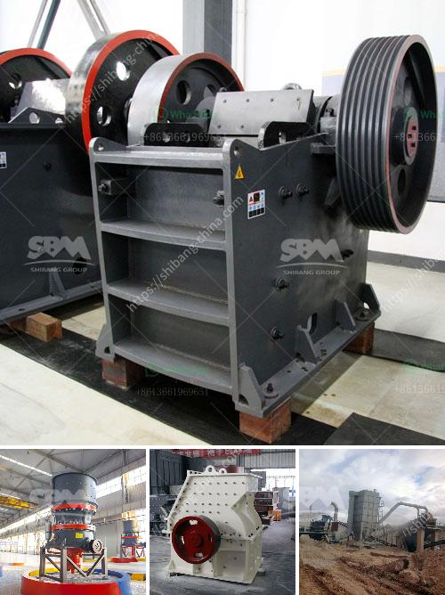

<h3>tph stone crusher</h3>
The stone crusher machine is a machine used to convert the stone from large size to large size. There are many types of stone breaking machine differentiated into primary crusher and secondary crusher. Each of these types of stone-breaking machines certainly have their own functions. Each stage of the processing of stones using different stone crusher with different power. The commonly used stone crusher includes jaw crusher, cone crusher, impact crusher, mobile crusher, vertical shaft impact crusher and so on.

Stone crusher is the necessary equipment in mining machinery. It is mainly used to break large stone into smaller pieces, such as gravel, sand, or rock dust. Different types of stone crushers have different uses. Jaw crushers are mainly used for primary crushing and a cone crusher is suitable for crushing various mid-hard and above mid-hard ores and rocks. The jaw crusher is made up of two vertical jaws, one is a fixed jaw and the other is a swing jaw. The swing jaw moves back and forth by a cam or pitman mechanism acting like a nutcracker or a class II lever. The stone in the upper part of the machine does not stand against the stone in the lower part. When the machine is working, the moving jaw rotates along the fixed jaw, but the shadow is not enabled, causing the stone to be crushed.

The stone crusher machine that Yifan machinery produced has the advantages of big crushing ratio, excellent grain shape, adjustable grain export, energy-saving and eco-frienenvironmental,high utilization ratio. Adjusting the speed of the rotor or the gap between the plate and the grinding chamber,mechanical and hydraulic adjustment are alternative. The wear parts of the stone crusher are made of high-quality wear-resistant materials. The processed materials are in class 3 or class 4, with uniform size and good shape. Besides, it can process various other materials such as granite, marble, basalt, limestone, quartz, river pebble, cobblestone, etc. Since the hardness of these materials is relatively large, the impact crusher is usually used for crushing material with low hardness such as limestone, dolomite, etc.

The stone crusher machine has features of simpler installation, simpler operation, and simpler maintenance, although there is no need for manual operation. Because the crusher has high degree of automation, it can realize automatic feeding, automatic discharging and automatic cleaning. This can greatly reduce labor cost and improve production efficiency. Moreover, the new type of crusher, with its high degree of automation, also plays a significant role in reducing dust pollution and noise pollution.

In conclusion, the stone crusher machine is widely used in mining, metallurgy, construction, highways, railways, water conservancy and chemical industries, and is the essential equipment for crushing various materials and ore minerals. It also has low energy consumption, high output, large crushing ratio, and simple structure. All these advantages make it a very ideal crusher machine to crush materials. It is indeed a good helper for users in the mining industry and other industries.
<h3>Contact us</h3><ul><li><strong>Whatsapp:&nbsp;<a href="https://wa.me/8613661969651">+8613661969651</a></strong></li><li><a href="https://swt.shibang-china.com/?git&amp;zhl&amp;tph stone crusher"><strong>Online Service(chat now)</strong></a></li></ul><h3>Related</h3><ul><li><a href='6inch rock crushing mill in guatemala.md'>6inch rock crushing mill in guatemala</a></li><li><a href='component of jaw crusher.md'>component of jaw crusher</a></li><li><a href='dry processing machine supplier.md'>dry processing machine supplier</a></li><li><a href='chromium ore mining equipmentr.md'>chromium ore mining equipmentr</a></li><li><a href='manufacturer of silica sand cleaning machines in europe.md'>manufacturer of silica sand cleaning machines in europe</a></li></ul>