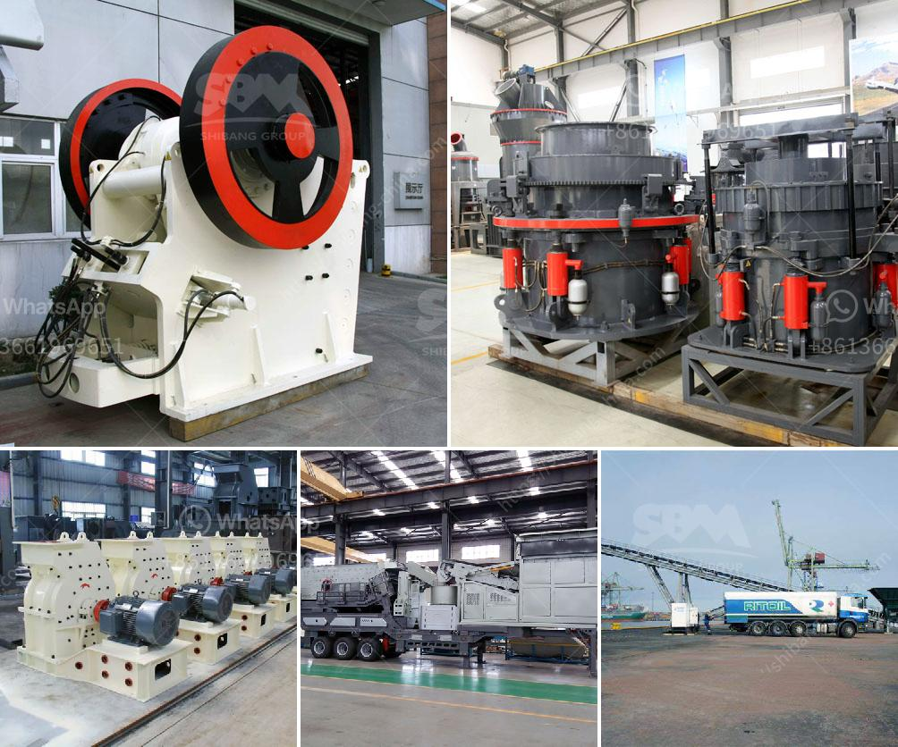

<h3>track crushing plant</h3>
The advancements in technology have revolutionized the construction industry, providing innovative solutions to meet the ever-increasing demand for infrastructure. One such breakthrough is the track crushing plant, a game-changer in the world of mobile crushing and screening equipment.

A track crushing plant is a mobile crusher plant that is primarily utilized in the recycling and demolition industries. It offers numerous benefits to contractors, including lower transportation costs, increased productivity, and reduced environmental impact. Let's delve deeper into the features and advantages that make this plant an essential asset for any construction project.

First and foremost, the track crushing plant is highly mobile. Equipped with tracks instead of traditional wheels, it can maneuver through rugged terrains and tight spaces with ease. This mobility allows contractors to bring the plant directly to the construction site, eliminating the need for costly transportation of materials to and from a fixed crushing plant. Additionally, it reduces the reliance on local aggregates, as the plant has the capability to crush materials on-site.

Furthermore, the track crushing plant boasts exceptional production capabilities. With its powerful crusher and efficient screening system, it can process a wide range of materials, including concrete, asphalt, and rock. This versatility enables contractors to recycle and reuse various materials, promoting sustainability and reducing the demand for new resources.

In terms of productivity, the track crushing plant excels in its ability to produce high-quality aggregates. The crusher's adjustable settings ensure consistent product sizes, meeting the precise requirements of different construction projects. Moreover, it can achieve high throughput rates, allowing contractors to complete jobs more efficiently and meet tight deadlines.

Another significant advantage of the track crushing plant is its low environmental impact. By recycling concrete and other materials, it helps divert waste from landfills, reducing the carbon footprint of construction activities. Additionally, the plant features advanced dust control systems to minimize air pollution during the crushing process. This commitment to environmental sustainability makes the track crushing plant an attractive choice for eco-conscious contractors.

To enhance operational efficiency, many track crushing plants are equipped with advanced technology and automation features. For instance, remote monitoring systems enable operators to control and monitor the plant's performance from a distance. This real-time information facilitates proactive decision-making, ensuring optimal productivity and minimizing downtime.

In conclusion, a track crushing plant is a revolutionary solution that offers numerous benefits to the construction industry. Its mobility, productivity, and environmental sustainability make it an essential piece of equipment for contractors seeking efficient and eco-friendly crushing and screening solutions. As technology continues to progress, we can expect further advancements in track crushing plant designs, further enhancing its capabilities and increasing its value in the construction sector.
<h3>Contact us</h3><ul><li><strong>Whatsapp:&nbsp;<a href="https://wa.me/8613661969651">+8613661969651</a></strong></li><li><a href="https://swt.shibang-china.com/?git&amp;zhl&amp;track crushing plant"><strong>Online Service(chat now)</strong></a></li></ul><h3>Related</h3><ul><li><a href='price of recycling equipment in italy.md'>price of recycling equipment in italy</a></li><li><a href='crusher prices in kenya.md'>crusher prices in kenya</a></li><li><a href='rock crusher mobile machine.md'>rock crusher mobile machine</a></li><li><a href='pulverizer crusher manufacturers in pune.md'>pulverizer crusher manufacturers in pune</a></li><li><a href='iron slag buyers in punjab india.md'>iron slag buyers in punjab india</a></li></ul>