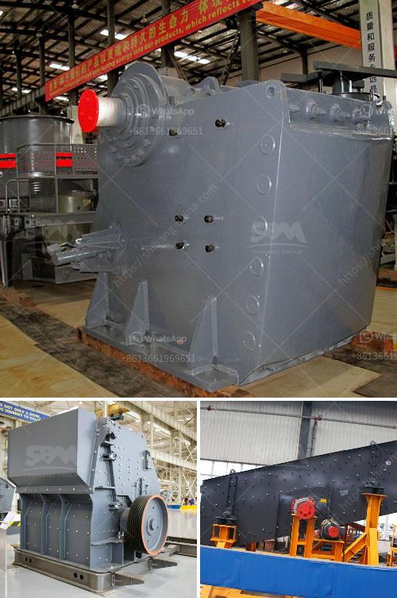

<h3>track impact crusher</h3>
The track impact crusher, also known as the impact crusher with crawler, is a versatile stone crushing machine that can be used for various applications. It is widely used in the field of mining, coal, construction waste recycling, and road construction. The track impact crusher combines high performance, versatility, and safety into one compact design, making it a top choice for any project.

One of the key features of the track impact crusher is its mobility. With a crawler chassis, this crusher is able to track its way around any job site, making it easy to transport and maneuver. It can be quickly set up and ready to go in a matter of minutes, allowing for maximum productivity. Whether it is working in a quarry, on a construction site, or demolishing concrete structures, the track impact crusher can easily handle it all.

The track impact crusher is equipped with a sophisticated control system to monitor and adjust the settings of the machine. This allows for easy and efficient control of the output material size, ensuring that the desired product specifications are met. The crusher also features a hydraulic overload protection system, preventing any damage to the machine from overloading. This feature is particularly important in the mining industry, where rocks and other materials can vary greatly in hardness and size.

The track impact crusher is designed for a wide range of applications. It can crush various materials such as limestone, granite, concrete, and asphalt, making it ideal for recycling construction and demolition waste. The crusher can also be used in the primary and secondary crushing stages of mining operations, reducing the size of ores for further processing. Its versatility makes it a valuable asset in any project.

In addition to its mobility and versatility, the track impact crusher is known for its high performance. Its powerful rotor and hammer design deliver high crushing efficiency, resulting in excellent particle shape and superior product quality. The crusher's rotor speed and adjustable impact curtains allow for optimal crushing performance, even with hard and abrasive materials. This ensures that the final product is of the highest quality, suitable for use in various applications.

Overall, the track impact crusher is a reliable and efficient crushing machine that offers numerous benefits to its users. Its mobility, versatility, and high performance make it a valuable asset in various industries. Whether it is recycling construction waste or crushing rocks in a quarry, the track impact crusher is up to the task. With its compact design and sophisticated control system, it is easy to operate and maintain, making it a top choice for any project.
<h3>Contact us</h3><ul><li><strong>Whatsapp:&nbsp;<a href="https://wa.me/8613661969651">+8613661969651</a></strong></li><li><a href="https://swt.shibang-china.com/?git&amp;zhl&amp;track impact crusher"><strong>Online Service(chat now)</strong></a></li></ul><h3>Related</h3><ul><li><a href='pulverizing machines in south africa.md'>pulverizing machines in south africa</a></li><li><a href='cost estimates of a chrome processing plant.md'>cost estimates of a chrome processing plant</a></li><li><a href='high capacity stone hammer crusher.md'>high capacity stone hammer crusher</a></li><li><a href='stone crusher machine for home use in south africa.md'>stone crusher machine for home use in south africa</a></li><li><a href='gold processing company china.md'>gold processing company china</a></li></ul>