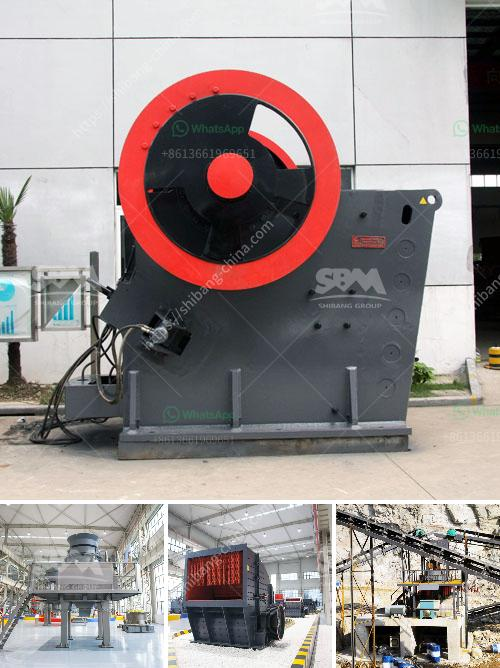

<h3>track-mounted crushing</h3>
Track-mounted crushing is a highly efficient and flexible process that allows businesses to effectively crush materials right at the job site. With advancements in technology, track-mounted crushers have become a popular choice for various industries. This article will delve into the benefits and applications of track-mounted crushing.

Track-mounted crushing involves the use of track-mounted crushers, which are mobile machines designed to crush rocks, concrete, asphalt, and other materials. These crushers are mounted onto a track chassis, allowing them to move around the job site easily and efficiently. This feature eliminates the need for expensive and time-consuming transportation of materials to a stationary crusher, making track-mounted crushing a cost-effective option.

One of the key advantages of track-mounted crushing is its flexibility. These crushers can be easily maneuvered around different job sites, even those with limited access or rough terrains. By eliminating the need for multiple machines or crushing plants, businesses can save time and manpower. This mobility also allows for quick setup and dismantling, ensuring minimal disruption to the operations.

Track-mounted crushers are capable of handling a wide range of materials. From recycled concrete and asphalt to natural rock, these machines can crush and process various materials on-site. This versatility makes track-mounted crushing suitable for construction, demolition, quarrying, and recycling applications. Additionally, the ability to adjust the crusher's settings allows for customizable output sizes, ensuring the production of the desired end product.

Another advantage of track-mounted crushers is their high efficiency. With their powerful engines and advanced crushing mechanisms, these machines can efficiently crush large quantities of materials in a short amount of time. The crushers are equipped with features such as a hydraulic gap adjustment, which allows for precise control over the final product's size. This efficiency can lead to increased productivity and cost savings for businesses.

Furthermore, track-mounted crushing is an environmentally friendly option. By crushing materials on-site, businesses can reduce the need for transportation and minimize the carbon footprint associated with shipping materials to and from the job site. Additionally, the use of recycled materials can contribute to sustainable practices, helping businesses meet their environmental goals.

In summary, track-mounted crushing offers numerous benefits for businesses in various industries. The mobility, flexibility, and efficiency of these crushers make them an attractive option for crushing needs on the job site. Their ability to handle a wide range of materials and produce customizable output sizes further enhances their versatility. Additionally, track-mounted crushing promotes environmental sustainability by minimizing transportation and encouraging the use of recycled materials. With these advantages, track-mounted crushing is certainly a worthwhile investment for businesses looking to streamline their operations and improve their bottom line.
<h3>Contact us</h3><ul><li><strong>Whatsapp:&nbsp;<a href="https://wa.me/8613661969651">+8613661969651</a></strong></li><li><a href="https://swt.shibang-china.com/?git&amp;zhl&amp;trackmounted crushing"><strong>Online Service(chat now)</strong></a></li></ul><h3>Related</h3><ul><li><a href='puzzolana crushers coimbatore.md'>puzzolana crushers coimbatore</a></li><li><a href='mobile dimension stone processing.md'>mobile dimension stone processing</a></li><li><a href='aggregate processing equipment.md'>aggregate processing equipment</a></li><li><a href='stone crusher and quarry plant in jordan.md'>stone crusher and quarry plant in jordan</a></li><li><a href='cost estimates of a chrome processing plant.md'>cost estimates of a chrome processing plant</a></li></ul>