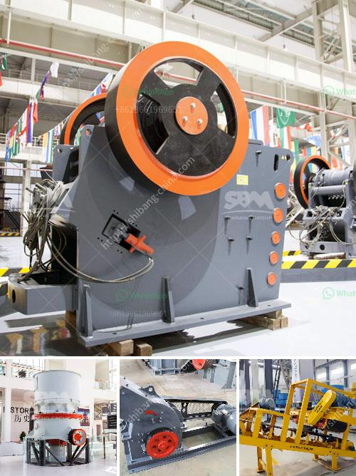

<h3>tractor mounted rock crusher uk</h3>
The importance of heavy machinery like the tractor-mounted rock crusher becomes clear when we take a closer look at the agricultural sector. The United Kingdom relies heavily on its agriculture, which contributes around $31.4 billion to the country's economy each year. To maintain a thriving agricultural industry, farmers need access to effective equipment that can simplify their tasks and enhance productivity. That's where the tractor-mounted rock crusher comes in.

The tractor-mounted rock crusher is a true testament to versatility and efficiency. Not only can it crush rocks, but it can also grind stumps and mulch wood. In fact, it can even work in tight spaces where other equipment cannot reach. Thanks to its robust design and cutting-edge technology, this machine has become an essential tool for farmers across the UK.

One of the major advantages of the tractor-mounted rock crusher is its ability to tackle rocks of various sizes. Whether it's small stones or large boulders, this machine can break them down into manageable pieces. This feature is particularly important in regions with rocky terrain, where traditional methods of rock removal can be time-consuming and labor-intensive. The tractor-mounted rock crusher streamlines the process, allowing farmers to save both time and money.

Another significant advantage of the tractor-mounted rock crusher is its mobility. Unlike larger machinery, which can be challenging to transport and maneuver, this machine can be easily attached to a tractor and taken to different locations on the farm. Whether it's a field that requires rock crushing or an area that needs wood mulching, the tractor-mounted rock crusher can be efficiently transported and set up within minutes.

But, it’s not just the convenience and versatility that make the tractor-mounted rock crusher stand out. It’s also the powerful performance it delivers. Equipped with advanced crushing mechanisms, the machine can pulverize rocks into different sizes, making them suitable for various farming applications. The crushed rocks can be used as building materials for farm infrastructure, such as driveways or roads. They can also be used as bedding material for livestock or as an amendment to improve soil fertility.

Furthermore, the tractor-mounted rock crusher helps farmers mitigate weed problems and enhance land cultivation. When rocks are crushed and spread over fields, they act as a natural barrier against weed growth. By reducing weed growth, farmers can focus on growing their crops without worrying about the ongoing battle against unwanted vegetation.

In conclusion, the tractor-mounted rock crusher undoubtedly serves as a valuable asset for farmers in the UK. Its ability to crush rocks, grind stumps, and mulch wood makes it versatile and essential for a wide range of farming tasks. With its mobility, convenience, and powerful performance, this machine revolutionizes the way farmers undertake rock-related tasks, saving time, money, and effort in the process. As the agricultural industry continues to evolve, investing in innovative machinery like the tractor-mounted rock crusher becomes increasingly indispensable for UK farmers looking to enhance their efficiency and productivity.
<h3>Contact us</h3><ul><li><strong>Whatsapp:&nbsp;<a href="https://wa.me/8613661969651">+8613661969651</a></strong></li><li><a href="https://swt.shibang-china.com/?git&amp;zhl&amp;tractor mounted rock crusher uk"><strong>Online Service(chat now)</strong></a></li></ul><h3>Related</h3><ul><li><a href='rock crusher in antioquia rock.md'>rock crusher in antioquia rock</a></li><li><a href='stone crusher kapasitas 150m.md'>stone crusher kapasitas 150m</a></li><li><a href='5 micron grinding mill.md'>5 micron grinding mill</a></li><li><a href='mobile dimension stone processing.md'>mobile dimension stone processing</a></li><li><a href='cement plant layout consultants in south kolkata.md'>cement plant layout consultants in south kolkata</a></li></ul>