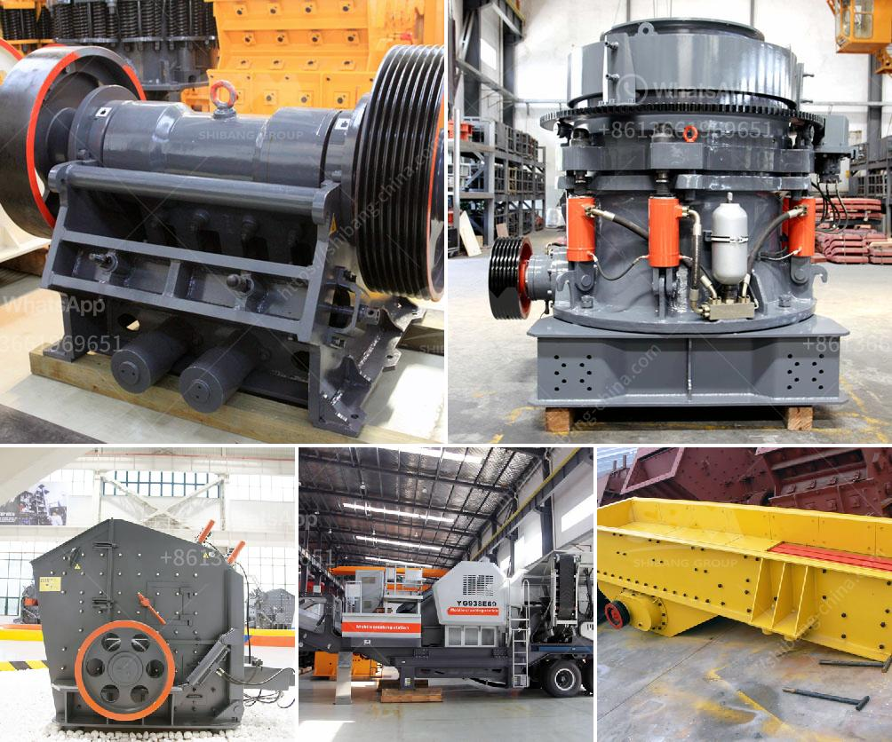

<h3>trading industrial stone crushers</h3>
In today's industrialized world, stone crushing machinery is integral to the construction industry as it helps to reduce large rocks into smaller pieces. These machines have an essential role to play in the construction and mining industry, as they ensure efficient crushing of rocks into granules that can be used as a raw material for various construction activities.

The stone crushing market is a booming industry with several players in the fray. With stiff competition, companies must increasingly look to trading industrial stone crushers to seek better value propositions in this highly competitive market. Trading these machines involves sourcing from original equipment manufacturers (OEMs) and reselling to the end-users, including construction companies and mining industries alike.

One of the primary factors driving the stone crushing market is the fact that these crushers reduce the feed material significantly, enabling finer crushing and reducing the overall energy consumption. They have an added advantage of producing a granular product with diverse sizes, depending on the customer's requirements. These properties make stone crushers immensely popular in the mining sector, where the aggregate of sizes plays a significant role.

When it comes to trading industrial stone crushers, one brand stands out: Metso Crushers. With their superior build quality and impeccable after-sales service, Metso Crushers have become the industry standard. As they put it, "Metso delivers value without compromise to those who invest in us." Whether it is a short-term or long-term investment, Metso Crushers delivers excellent performance with their rugged built, making them highly durable and reliable even in the harshest environments.

Trading industrial stone crushers involves carrying a large inventory of equipment and parts, ensuring quick availability to get the crushing plant up and running in the shortest possible time. Investing with a reliable trading company means that the inventory is well-maintained and regularly serviced to eliminate any downtime for your construction or mining projects.

Trading in this industry requires gaining a deep understanding of market trends, customer preferences, and the competitive landscape. Keeping track of emerging technologies and innovations is critical to sourcing and trading the latest machinery that meets or exceeds your customer's expectations. Additionally, being aware of changing regulations and safety standards is crucial to avoid any legal issues or liabilities while trading.

When trading industrial stone crushers, choosing the right trading partner is of paramount importance. Look for a trustworthy company that has extensive experience in handling these machines, with a solid reputation in the industry. A reliable trading partner will have a vast network of OEMs, enabling them to offer a wide range of stone crushers to cater to the diverse needs of their customers.

In conclusion, trading industrial stone crushers is a game of supply and demand. Thanks to advances in technology and machinery, companies can now rely on trusted trading partners to source the right kind of crushers that will best serve their business interests. These machines are vital in reducing rocks into smaller pieces, enabling construction and mining companies to create valuable materials for various projects. As this industry continues to grow, businesses that make smart decisions in trading industrial stone crushers will reap rewards in this competitive market.
<h3>Contact us</h3><ul><li><strong>Whatsapp:&nbsp;<a href="https://wa.me/8613661969651">+8613661969651</a></strong></li><li><a href="https://swt.shibang-china.com/?git&amp;zhl&amp;trading industrial stone crushers"><strong>Online Service(chat now)</strong></a></li></ul><h3>Related</h3><ul><li><a href='advantages of reversible impact hammer crusher.md'>advantages of reversible impact hammer crusher</a></li><li><a href='ball mill specification.md'>ball mill specification</a></li><li><a href='dolomite crushing plant in bharuch.md'>dolomite crushing plant in bharuch</a></li><li><a href='gypsum crusher plants in pakistan.md'>gypsum crusher plants in pakistan</a></li><li><a href='stone crusher uganda.md'>stone crusher uganda</a></li></ul>