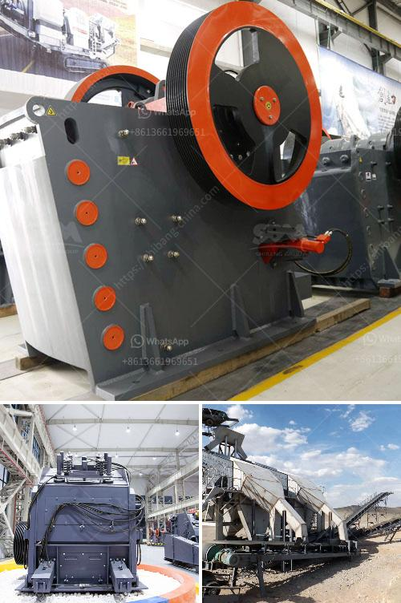

<h3>turkey crusher company</h3>
Turkey is a country rich in natural resources and minerals. With its strategic location at the crossroads of Europe and Asia, it has been a major hub for trade and commerce for centuries. One of the leading industries in the country is quarrying and mining. Turkey crusher company is a vital partner to numerous mining and quarrying projects throughout the Middle East.

Turkey boasts the highest quality marble reserves in the world, covering an estimated 4 billion cubic meters. These marble reserves are mostly found in countries such as Afyon, Balıkesir, Denizli, Diyarbakir, Elazig, and Mugla. They are utilized in a variety of applications, including construction, interior decoration, and sculpture. To extract and process these precious resources, the quarrying and mining sector relies heavily on advanced machinery and equipment.

Turkey crusher company, established in 1948, is a leading manufacturer of industrial crushing, screening and washing equipment. Throughout its long history, Turkey crusher company has been an innovative pioneer with many key industry firsts, constantly developing new techniques and equipment to provide cutting-edge solutions to its customers.

The company's product range is extensive, catering to various needs and requirements in the mining and quarrying sector. Their primary jaw, secondary and tertiary cone crushers can break down even the toughest rock materials into small, easily manageable sizes. Their high capacity screens can efficiently separate different-sized materials, ensuring optimal usage of resources. The washing equipment is designed to remove impurities from the processed materials, resulting in a higher-quality end product.

What sets Turkey crusher company apart from its competitors is its commitment to research and development. The company's dedicated team of engineers and technicians continuously work on improving existing products and developing new ones to meet the ever-evolving demands of the industry. By investing in advanced technologies and cutting-edge machinery, Turkey crusher company ensures that its customers stay ahead in terms of productivity, efficiency, and cost-effectiveness.

Furthermore, Turkey crusher company emphasizes on customer satisfaction and after-sales support. Their team of qualified technicians provides comprehensive training and support to ensure that customers can operate their equipment at maximum efficiency. They also offer a prompt and reliable spare parts service, ensuring minimal downtime and uninterrupted production.

In addition to their local market presence, Turkey crusher company has expanded its operations to become a global player in the quarrying and mining industry. They have successfully completed projects across the Middle East, Africa, Europe, and even as far as Asia. This international presence has not only boosted the company's reputation but has also helped Turkey establish itself as a leading center for crushing and screening equipment.

In conclusion, Turkey crusher company plays a crucial role in the quarrying and mining industry in Turkey and beyond. With its high-quality products, dedication to research and development, and exceptional customer support, it continues to contribute to the growth and success of its customers. As the demand for natural resources and minerals increases, Turkey crusher company is poised to further expand its operations and provide cutting-edge solutions to meet the industry's future challenges.
<h3>Contact us</h3><ul><li><strong>Whatsapp:&nbsp;<a href="https://wa.me/8613661969651">+8613661969651</a></strong></li><li><a href="https://swt.shibang-china.com/?git&amp;zhl&amp;turkey crusher company"><strong>Online Service(chat now)</strong></a></li></ul><h3>Related</h3><ul><li><a href='process flow gold copper mining.md'>process flow gold copper mining</a></li><li><a href='crusher screening plant.md'>crusher screening plant</a></li><li><a href='price limestone crusher for sale.md'>price limestone crusher for sale</a></li><li><a href='manufacturers of stone crushers in usa.md'>manufacturers of stone crushers in usa</a></li><li><a href='sand washing machine lsx920.md'>sand washing machine lsx920</a></li></ul>