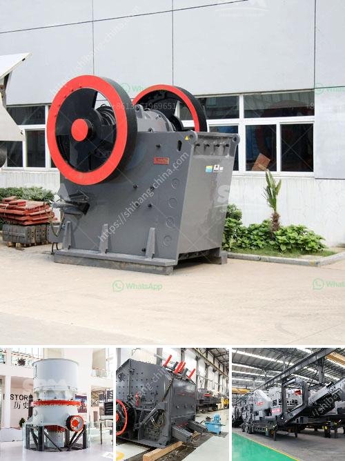

<h3>turkey of gold refinery project cost</h3>
The gold refinery project in Turkey has gained significant attention and interest from investors around the world. With Turkey being one of the largest gold consumer countries, it comes as no surprise that the nation is looking to establish a gold refinery facility to meet its domestic demand and also to become a major player in the global gold market.

The estimated cost of setting up a gold refinery project in Turkey falls between $150 million to $300 million, depending on the capacity and technology used. This cost includes land acquisition, equipment installation, refining machinery, and other operational expenses.

One of the major factors contributing to the cost is the choice of technology. Turkey aims to use advanced and environmentally friendly refining techniques, which could increase the initial investment. However, the benefits of adopting sustainable technology far outweigh the extra costs, as it ensures a cleaner and greener process.

The project costs become an investment when considering the potential economic benefits of the gold refinery. Turkey currently exports most of its raw gold to countries like Switzerland for refining. By establishing its own refinery, Turkey will keep the added value within its borders, creating job opportunities and boosting the country's economy.

Furthermore, having a local refinery will enhance Turkey's position in the global gold market and provide a more reliable supply chain for domestic gold traders and jewelry manufacturers. This would reduce dependency on external factors, such as fluctuating international prices and geopolitical tensions.

To attract investors, the Turkish government has implemented various measures to support the establishment of gold refineries, including tax incentives and streamlined bureaucratic processes. This has resulted in increased interest from both local and foreign investors, who see the potential of this project in Turkey.

In conclusion, while the gold refinery project in Turkey may require a significant initial investment, the potential benefits far outweigh the costs. With a growing domestic demand for gold and the opportunity to become a major global player in the gold market, Turkey's endeavor in establishing a gold refinery is a promising and lucrative venture.
<h3>Contact us</h3><ul><li><strong>Whatsapp:&nbsp;<a href="https://wa.me/8613661969651">+8613661969651</a></strong></li><li><a href="https://swt.shibang-china.com/?git&amp;zhl&amp;turkey of gold refinery project cost"><strong>Online Service(chat now)</strong></a></li></ul><h3>Related</h3><ul><li><a href='stone crusher output per hour india.md'>stone crusher output per hour india</a></li><li><a href='concrete crusher for sale used in canada.md'>concrete crusher for sale used in canada</a></li><li><a href='working principle of ball mill pdf.md'>working principle of ball mill pdf</a></li><li><a href='crushers for hire south africa.md'>crushers for hire south africa</a></li><li><a href='magnetic separator distributor in surabaya.md'>magnetic separator distributor in surabaya</a></li></ul>