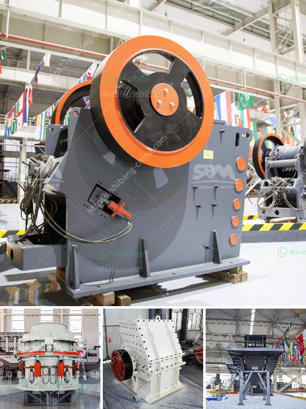

<h3>turkish manufacturer belt conveyor</h3>
Belt conveyors are widely used in various industries for the transportation of goods, materials, and products. As one of the key players in the global manufacturing industry, Turkey has emerged as a leading hub for belt conveyor production. Turkish manufacturers have gained a solid reputation for their high-quality and efficient belt conveyor systems, meeting the demands of industries worldwide.

One of the leading Turkish manufacturers of belt conveyors is known for their commitment to excellence and innovation. They utilize state-of-the-art technology and employ a team of skilled engineers to design and produce belt conveyor systems that maximize productivity and minimize downtime.

The belt conveyors produced by Turkish manufacturers are notable for their durability and reliability. These conveyor systems are made from the finest materials, ensuring that they can withstand heavy loads and harsh working conditions. The conveyor belts used in these systems are specially designed to offer excellent grip and traction while maintaining a smooth and consistent movement of goods.

Turkish manufacturer belt conveyors are also praised for their energy efficiency. These systems are equipped with advanced motors and drives that minimize power consumption, resulting in significant energy savings for the end-user. This not only contributes to environmental sustainability but also helps companies reduce their operating costs.

Furthermore, Turkish manufacturers understand the importance of customization to accommodate the unique needs of different industries. They offer a wide range of belt conveyor models, allowing customers to choose the size, capacity, and specifications that best suit their requirements. Whether it is for transporting heavy goods in a warehouse or handling delicate products in a food processing plant, Turkish manufacturers can provide tailor-made belt conveyor solutions for every application.

In addition to their product offerings, Turkish manufacturers also place great emphasis on customer satisfaction. They provide comprehensive after-sales services, ensuring that their systems are installed correctly and operating optimally. Responsive customer support is also available to address any inquiries or issues that may arise during the lifespan of the conveyor systems.

The success of Turkish manufacturer belt conveyors can be attributed to the strong manufacturing infrastructure in the country. Turkey has a highly skilled workforce and a well-established industrial base, enabling manufacturers to produce high-quality products at competitive prices. Additionally, the strategic location of Turkey allows for easy access to both European and Asian markets, making it an ideal hub for global trade.

In conclusion, Turkish manufacturer belt conveyors have established themselves as a reliable and efficient solution for various industries around the world. Their commitment to quality, durability, energy efficiency, and customization has made them a preferred choice for companies seeking reliable conveyor systems. With their focus on customer satisfaction and strong manufacturing capabilities, Turkish manufacturers continue to dominate the global market, contributing significantly to the growth and development of the belt conveyor industry.
<h3>Contact us</h3><ul><li><strong>Whatsapp:&nbsp;<a href="https://wa.me/8613661969651">+8613661969651</a></strong></li><li><a href="https://swt.shibang-china.com/?git&amp;zhl&amp;turkish manufacturer belt conveyor"><strong>Online Service(chat now)</strong></a></li></ul><h3>Related</h3><ul><li><a href='used machines from china.md'>used machines from china</a></li><li><a href='cement clinker grinding plant in india.md'>cement clinker grinding plant in india</a></li><li><a href='japan of mobile crushing plant.md'>japan of mobile crushing plant</a></li><li><a href='diamond plant for sale in south africa.md'>diamond plant for sale in south africa</a></li><li><a href='medium ballast making machine.md'>medium ballast making machine</a></li></ul>