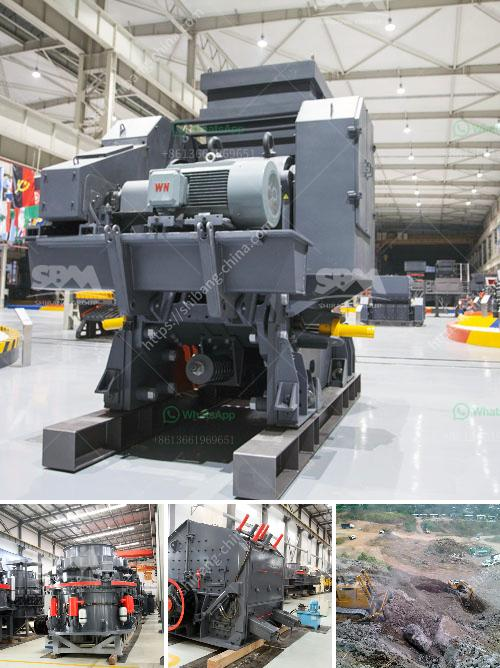

<h3>type of crusher machine is best</h3>
When it comes to crushing equipment, selecting the right type of crusher machine is essential for every construction or mining project. There are various types of crushers available in the market that are used to break down different materials into smaller pieces. Each crusher machine is designed differently, and selecting the right one depends on the specific requirements of the project and the material being crushed.

One of the most commonly used crushers is the jaw crusher. It is a heavy-duty machine that is used to crush materials such as ores, rocks, and demolition debris. The jaw crusher has a fixed jaw and a moving jaw, which together create a V-shaped crushing chamber. The materials are fed into the crushing chamber and crushed between the jaws. Jaw crushers are known for their reliability, high production capacity, and low operating costs. However, they may not be suitable for all materials.

Another popular type of crusher machine is the impact crusher. It uses impact force to crush materials, making it ideal for crushing softer materials such as limestone, gypsum, and coal. The machine consists of a rotor that rotates at a high speed, and when the material enters the crushing chamber, it strikes the rotor and is shattered into smaller pieces. Impact crushers are known for their high reduction ratios and the ability to produce a consistently shaped product.

Cone crushers are also widely used in the construction and mining industries. They are designed to crush hard and abrasive materials such as granite, basalt, and iron ore. Cone crushers have a conical-shaped crushing chamber and a mantle that rotates around a central axis. As the mantle moves, it compresses the material against the concave liner, breaking it down into smaller pieces. Cone crushers are known for their versatility, high productivity, and excellent particle shape.

Lastly, there are also specialized types of crushers available for specific applications. For instance, a gyratory crusher is used for large-scale mining operations and can handle extremely large chunks of materials. Additionally, roll crushers are designed for crushing friable materials such as coal and clay.

In conclusion, selecting the right type of crusher machine is crucial for any construction or mining project. Jaw crushers, impact crushers, and cone crushers are the most commonly used types of crushers, each offering unique benefits depending on the specific requirements of the project. It is essential to consider factors such as the material being crushed, production capacity, operating costs, and particle shape when choosing the best crusher machine for a particular application. Investing in the right crusher machine will result in improved productivity, reduced downtime, and overall cost savings.
<h3>Contact us</h3><ul><li><strong>Whatsapp:&nbsp;<a href="https://wa.me/8613661969651">+8613661969651</a></strong></li><li><a href="https://swt.shibang-china.com/?git&amp;zhl&amp;type of crusher machine is best"><strong>Online Service(chat now)</strong></a></li></ul><h3>Related</h3><ul><li><a href='china talc processing factory.md'>china talc processing factory</a></li><li><a href='buy granite crusher.md'>buy granite crusher</a></li><li><a href='gold processing company china.md'>gold processing company china</a></li><li><a href='cement mill manufacturers in italy.md'>cement mill manufacturers in italy</a></li><li><a href='small gold mining plant in south africa.md'>small gold mining plant in south africa</a></li></ul>