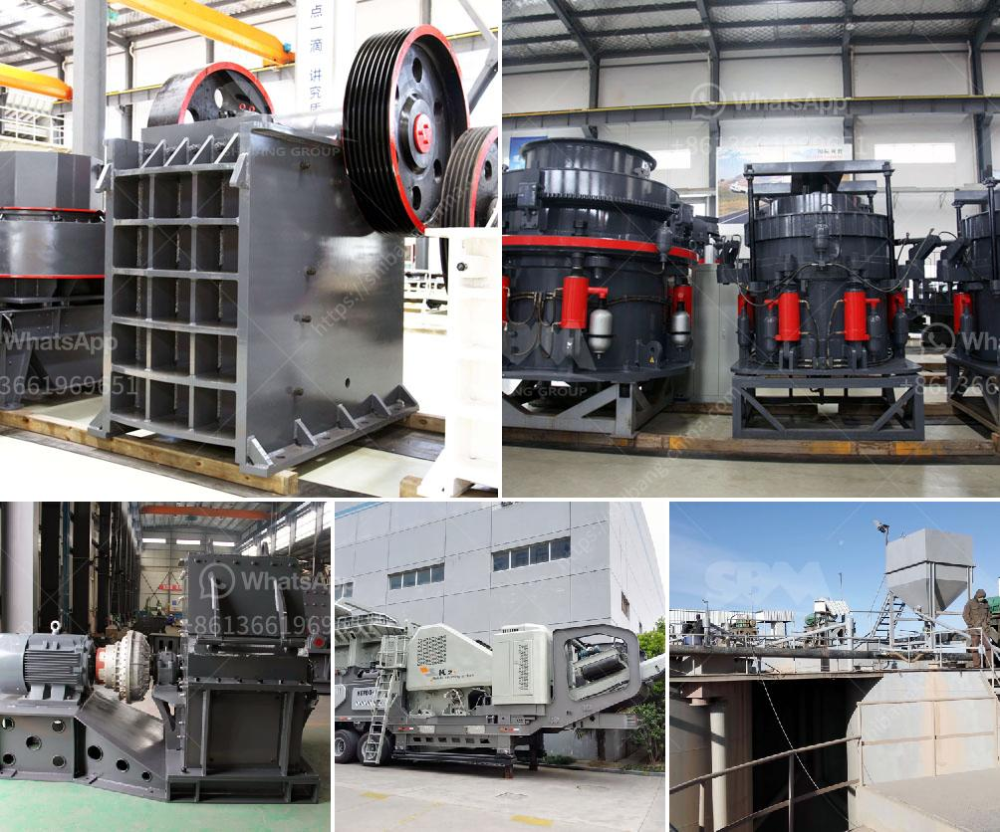

<h3>types of coal crusher used in industry</h3>
Coal is a combustible black or brownish-black sedimentary rock which is composed mainly of carbon, hydrogen, and oxygen. There are primarily two types of coal used as fuel: thermal coal, which is primarily used in power generation, and metallurgical coal, which is primarily used in steel production. Thermal coal is also known as steam coal, while metallurgical coal is also known as coking coal due to its ability to produce coke, which is a fuel used in blast furnaces to melt iron ore.

In the coal mining industry, coal crusher is used for crushing coal into small size for the next grinding process. The primary coal crusher is jaw crusher, which is used for crushing coal and it is widely used in primary crushing process in many industries such as coal mining, quarrying, construction, chemical, cement, etc. Jaw crusher has the advantages of large crushing ratio, uniform product size, simple structure, convenient maintenance, etc.

There are mainly three types of coal crusher: jaw crusher, impact crusher and cone crusher. Jaw crusher is used for crushing coarsely, and it is mainly used for primary crushing process. Impact crusher is used for crushing medium-hardness materials and it is generally used for secondary crushing process. Cone crusher is used for crushing hard materials and it is widely used in metallurgy, construction, hydropower, transportation, chemical industry, etc.

In the coal industry, which is one of the largest consumers of energy, coal-fired power plants are still widely used. In order to make full use of coal resources and reduce environmental pollution, various technologies have been developed to improve coal-fired power generation efficiency and reduce emissions. One of the key technologies is the coal crusher, which plays an important role in coal-fired power generation.

The coal crusher used in the coal industry has the following characteristics: 1. Large crushing ratio. Its crushing ratio can reach up to 15-20, and the particle size of the finished product is uniform. 2. Low energy consumption. It consumes less energy compared with other crushers. 3. Low maintenance costs. The coal crusher has a simple structure and is easy to operate and maintain. 4. High production efficiency. The coal crusher can process large quantities of coal with high efficiency. 5. High degree of automation. The coal crusher uses automatic control methods to make the operation more automated and intelligent.

In summary, the coal crusher has been widely used in the coal industry and has played an important role in promoting economic development. The types of coal crusher are various, such as jaw crusher, impact crusher, cone crusher, hammer crusher, etc. The specifications of the coal crusher are different for different types of crushers. Different types of crushers have different market demands, so the investment in coal crusher is also different. Therefore, it is recommended that investors choose the appropriate coal crusher according to their actual production needs and budget.
<h3>Contact us</h3><ul><li><strong>Whatsapp:&nbsp;<a href="https://wa.me/8613661969651">+8613661969651</a></strong></li><li><a href="https://swt.shibang-china.com/?git&amp;zhl&amp;types of coal crusher used in industry"><strong>Online Service(chat now)</strong></a></li></ul><h3>Related</h3><ul><li><a href='graphite beneficiation plant at nigeria.md'>graphite beneficiation plant at nigeria</a></li><li><a href='ethiopia stone crushing plant.md'>ethiopia stone crushing plant</a></li><li><a href='turkish manufacturer belt conveyor.md'>turkish manufacturer belt conveyor</a></li><li><a href='difference between css or oss crusher.md'>difference between css or oss crusher</a></li><li><a href='machines use for mining sand from river.md'>machines use for mining sand from river</a></li></ul>