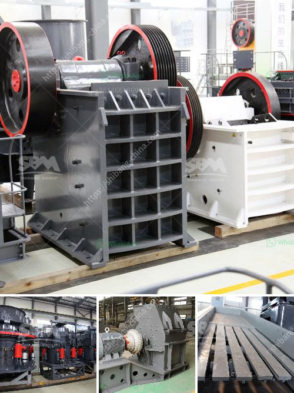

<h3>types of crushed aggregates in pakistan</h3>
Crushed aggregates are a popular choice in the construction industry. They are extensively used in road bases, concrete production, construction fill, and drainage applications. In Pakistan, there are various types of crushed aggregates available, each with its distinct characteristics and uses.

Firstly, one of the most commonly used types of crushed aggregates is limestone. Limestone aggregates are obtained from natural limestone rocks and are widely used in the construction of buildings and infrastructure. They are known for their durability, strength, and ability to withstand heavy loads. Limestone aggregates are often used as a base material for roads, highways, and parking lots.

Another commonly used crushed aggregate in Pakistan is gravel. Gravel aggregates consist of small rounded stones, usually derived from riverbeds or beach areas. Gravel aggregates are known for their versatility and aesthetic appeal. They are often used in the construction of driveways, walkways, and landscaping projects. Due to their naturally polished appearance, gravel aggregates are also used in exposed concrete surfaces to create an attractive finish.

Crushed aggregates can also be made from crushed stone, commonly known as crushed rock. Crushed stone aggregates are obtained from various quarries and crushed to specific sizes. They are known for their strength and durability, making them suitable for a wide range of construction applications. Crushed stone aggregates are often used as a base material for concrete and asphalt production, as well as in the construction of roads, bridges, and retaining walls.

Lastly, another type of crushed aggregate commonly used in Pakistan is sand. Sand aggregates are fine particles of crushed rocks and minerals. They are often used in construction projects that require a smooth and fine finish, such as plastering, tiling, and rendering. Sand aggregates are also used in the production of concrete, mortar, and asphalt.

In conclusion, crushed aggregates are an essential component in the construction industry in Pakistan. Different types of crushed aggregates, including limestone, gravel, crushed stone, and sand, are readily available to meet the diverse needs of construction projects. Choosing the appropriate type of crushed aggregate is crucial to ensure the quality, strength, and durability of the construction work.
<h3>Contact us</h3><ul><li><strong>Whatsapp:&nbsp;<a href="https://wa.me/8613661969651">+8613661969651</a></strong></li><li><a href="https://swt.shibang-china.com/?git&amp;zhl&amp;types of crushed aggregates in pakistan"><strong>Online Service(chat now)</strong></a></li></ul><h3>Related</h3><ul><li><a href='jaw crusher for hire south africa for limestone.md'>jaw crusher for hire south africa for limestone</a></li><li><a href='coal mill reject conveying system.md'>coal mill reject conveying system</a></li><li><a href='mobile gold processing plant with price.md'>mobile gold processing plant with price</a></li><li><a href='russia copper ore crushing plant.md'>russia copper ore crushing plant</a></li><li><a href='hydraulic jaw crusher.md'>hydraulic jaw crusher</a></li></ul>