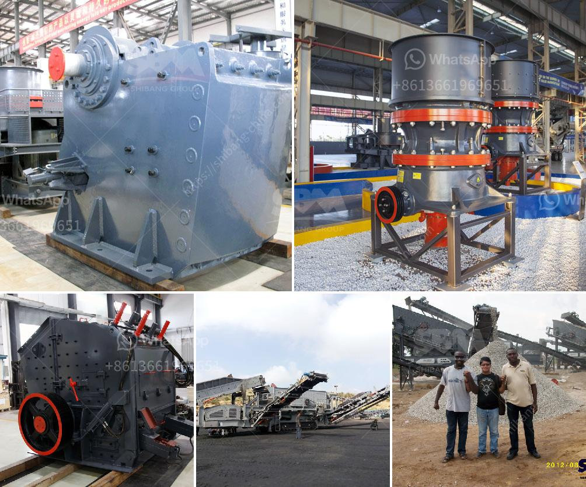

<h3>types of diaphragm in ball mill</h3>
A ball mill is a grinding device that is used to turn material into fine powder. Ball mills are cylindrical in shape, and are often the grinder of choice when it comes to mashing paints, ores, ceramic materials, and certain hard chemicals. By rotating on a horizontal axis, a ball mill can effectively convert a hard material into a loose powder.

In addition to the material that is meant to be ground, ball mills also contain a grinding material. Ceramic balls, stainless steel balls, and flint pieces are often used as grinding materials. When this matter grinds against another matter, the result is a crushed powder that can then be used for other applications.

An industrial ball mill has the ability to operate continuously. These ball mills are often controlled by a machine that feeds materials through one end of the mill and out the other end. Smaller mills can only operate with the help of a cylindrical container containing a tight cap. These mills are part of a pulley system that uses belts and pulleys to operate smaller ball mills.

The concept of the ball mill is fairly straightforward. One simply needs a means to crush material in order to navigate to the next piece of machinery. Typically, a ball mill will take its material and convert it into a powder by being loaded into a barrel that contains metallic or ceramic balls.

Powerful and precise, the ball mill contains three types of diaphragms to help regulate the impact and weight of the ball during operation. The UMS, Unidan Mill S type FLS Ball mill which are used in the Cement industry for grinding clinker material. The present mill inlet chute can be used for the two compartment ball mills only in which primary and finish grinding both are takes place. It may be a closed or open circuit grinding systems.

In recent days, the Ball mill grinding systems are used with the Roller press and it is developing very fastly. The primary grinding is done by the Roller press and finish grinding takes place in Ball mill. Because of this, we can increase the Ball mill capacity as well as the Cement production.

2- Double diaphragm. Again, these produced by Christian Pfeiffer, are in a semi-flexible configuration.

3- Lining diaphragm: These are Polysius’s flagship products — picnic plate or semi-vibrating variations.

Each type of diaphragm has its strengths and weaknesses, but all perform the same general function: they regulate the flow of materials within the ball mill and ensure that all particles are ground to a specific size.

Choosing the right diaphragm for your ball mill can be a complex process. Factors such as material hardness, product size, and changes in process conditions must be factored in. However, with the right supplier, your ball mill diaphragm choices can be simplified, ensuring a smooth process flow and optimal grinding conditions for your particular application.

In conclusion, the diaphragm in a ball mill plays a vital role in the overall operation of the machine. By effectively regulating the flow of materials into the mill and controlling the grinding process, these external devices can help improve efficiency and enhance product quality.
<h3>Contact us</h3><ul><li><strong>Whatsapp:&nbsp;<a href="https://wa.me/8613661969651">+8613661969651</a></strong></li><li><a href="https://swt.shibang-china.com/?git&amp;zhl&amp;types of diaphragm in ball mill"><strong>Online Service(chat now)</strong></a></li></ul><h3>Related</h3><ul><li><a href='iron ore processing plant.md'>iron ore processing plant</a></li><li><a href='cement grinding station quotations.md'>cement grinding station quotations</a></li><li><a href='indonesia coal screen machine.md'>indonesia coal screen machine</a></li><li><a href='cone crusher for sale in uae.md'>cone crusher for sale in uae</a></li><li><a href='crusher supplier saudi.md'>crusher supplier saudi</a></li></ul>