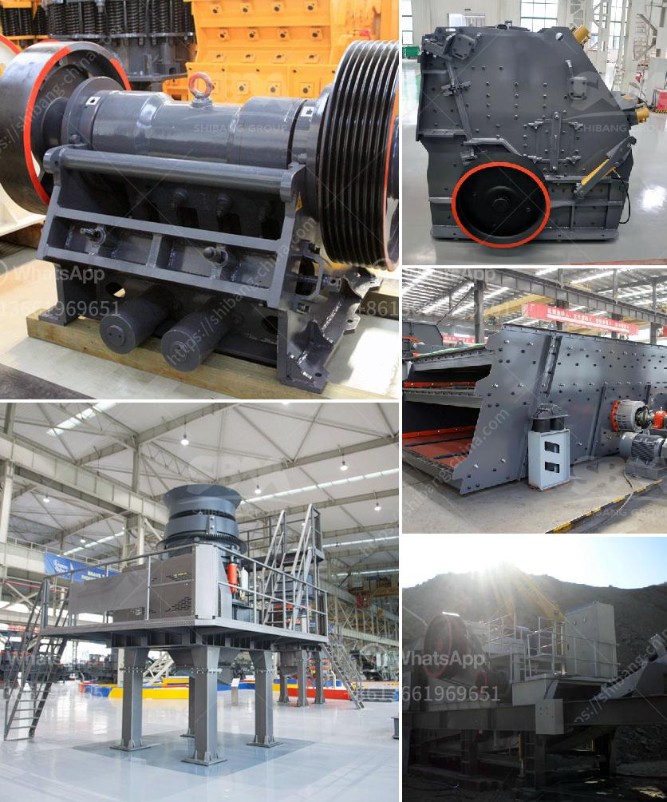

<h3>types of limestone crusher</h3>
Limestone is a sedimentary rock composed mainly of calcium carbonate (CaCO3), usually calcite. In the cement plant, limestone is the major raw material for cement production. Go through crushing, grinding process, and then make in the dust. Limestone comes in large pieces from the quarry to the factory and, therefore, must be crushed to reduce and homogenize the grain size.

To effect the grinding of the most important raw material for the process in terms of quantity, arose the following alternatives:

- Jaw crusher for primary crushing limestone: jaw crusher is used as primary crushing equipment in the crushing plant of limestone. There are two types of jaw crusher: jaw crusher series PEW and PE series Jaw Crusher. Jaw crushers have different capacity and different fineness of the finished products. The common capacity is 50t / h, 100 t / h, 150 t / h 200 t / h, and 300 to 400 t / h. The usual fine is 20 to 50 mm.

After primary crushing, use the impact crusher for secondary crushing. Impact Crusher is also the stone crushing machine used in common limestone quarry. It has the functions of grinding and training, can make very good cubic shape. Tertiary crushing limestone

Cone Crusher Grinding tertiary limestone: After the first other shredding available gyratory crusher cone but this time Simons system. Their choice is based primarily on the adaptation to a fineness greater, since there is present as large pieces of limestone are added also other advantages. If you need finer particle size, you can use the high-efficiency limestone grinding mills, such as roller grinding mills and impact grinding mills.

For limestone processing, the commonly used crushing machines are jaw crusher, impact crusher, cone crusher, hammer crusher, roll crusher and so on. In order to help customers select suitable crusher equipment, it focuses on the following factors: aspects like the nature of raw materials, amount of processing, feed size and finished product granularity.

In general, jaw crusher is used as the primary crusher, and cone crusher and impact crusher as the secondary. And they always combine with each other in the whole crushing line during the crushing process.

Before processing, the materials are limestone. After processing, they become limestone aggregate. Lime can be categorized into ordinary lime and hydrated lime.it is required the use of crushing and grinding equipment process in limestone.

In the process of production and processing of limestone, it mainly uses the following equipment: milling machine (Raymond mill or high pressure grinding), jaw crusher, hammer crusher, impact crusher, sand making machine produced by SBM.

limestone will be crushed by crusher equipment. After crushing, the particle size of materials is suitable for transmission equipment to the European version of T or T shaped grinding medium speed mill.

'We are researching and producing all kinds of crushers, stone crusher, crushing plants, etc. So please, get in touch with us and get more information about limestone crusher. We will reply to you as soon as possible.'
<h3>Contact us</h3><ul><li><strong>Whatsapp:&nbsp;<a href="https://wa.me/8613661969651">+8613661969651</a></strong></li><li><a href="https://swt.shibang-china.com/?git&amp;zhl&amp;types of limestone crusher"><strong>Online Service(chat now)</strong></a></li></ul><h3>Related</h3><ul><li><a href='5 micron grinding mill.md'>5 micron grinding mill</a></li><li><a href='small bleaching powder manufacturing plant project report.md'>small bleaching powder manufacturing plant project report</a></li><li><a href='granite quarry machinery for sale.md'>granite quarry machinery for sale</a></li><li><a href='lister petter maize hammer mills.md'>lister petter maize hammer mills</a></li><li><a href='sand washing system.md'>sand washing system</a></li></ul>