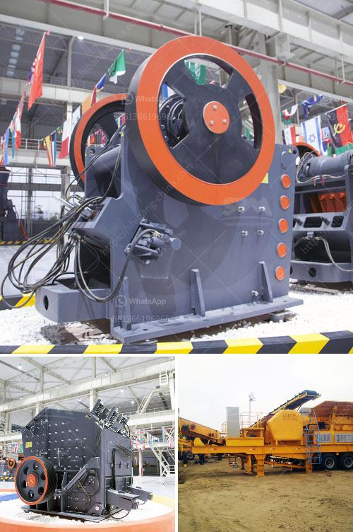

<h3>types of stone crushing plant pdf</h3>
A stone crushing plant is primarily involved in the manufacture of aggregates of various sizes (coarse aggregates, crusher run, rock sand, and other fine aggregates) from basalt boulders. Coarse aggregates are usually used in ready mix concrete and asphaltic concrete. Crusher run is used for the bases and sub-bases for road making. Fine aggregates are used for the production of concrete and plastering.

The stone crushing plant can be operated as independent units or as a two- or three-stage crushing application: from primary to secondary, tertiary and fine crushing. As required, a portable screen can be attached to the process. Lightweight and superior in engineering design, these stone crushing plants offer exceptional crushing performance. They are ideally suited to the most demanding portable crushing and screening applications.

Take the opportunity to learn about the various stone crushing plants being offered in the market today. From primary to secondary and tertiary crushing, there is a wide range of choices including horizontal shaft impact crushers (HSI), cone crushers, vertical shaft impact crushers (VSI), and vibrating screens. Choosing the right crushing plant is crucial to meet the building and road construction requirements of a project.

There are several factors to consider in choosing the right stone crusher plant, such as production requirements, capital expenditure, ore characteristics, project location, operational considerations, climatic conditions, and local regulations. Other important aspects include the maximum feed size, the machine’s capacity, the feed gradation, and the required product size.

Different types of stone crushing plants have different capacities. The footprint of a standard plant can range from 30 to 1000 square meters. The installation and maintenance of these plants become complex, and therefore, require specialized services.

The stone crushing plant has become increasingly automated with improved equipment, such as high-quality screening systems, belt conveyors, and vibratory feeders. Efficient automation, integrated control systems, and user-friendly operator interfaces help ensure the efficient and productive operation of the crushing plant.

The stone crushing plant has flexible operation and can be equipped with multiple stone crushers for various purposes. In addition, the mobile stone crushing plant has flexible operation and does not require extensive installation and debugging. This saves a lot of time and transportation costs.

Another important factor is the space required by the crushing equipment. The stone crushing equipment occupies large-scale land resources and has high depreciation costs. However, in areas where land is plentiful, such as rural areas or mountainous areas, it is still feasible to establish large-scale stone crushing plants.

Stone crushing plant layout is based mostly on dimensional analysis and multiple services. To compile detailed information on the equipment, layout, and layout dimensions of the stone crushing plant, a detailed analysis of the new aggregate production line is carried out, and then the design of the whole plant is carried out to ensure the plant’s structural layout is geometrical and rational.

In conclusion, different types of stone crushing plants have different production capacities. They may have different automation levels, and the size of the required particles will also depend on the specific requirements of the rock crushing plant. In addition, many manufacturers can provide comprehensive support services for crushing plants, such as installation, maintenance, and upgrade services. Therefore, it is essential to select the right stone crushing plant that meets the specific requirements of a particular project.
<h3>Contact us</h3><ul><li><strong>Whatsapp:&nbsp;<a href="https://wa.me/8613661969651">+8613661969651</a></strong></li><li><a href="https://swt.shibang-china.com/?git&amp;zhl&amp;types of stone crushing plant pdf"><strong>Online Service(chat now)</strong></a></li></ul><h3>Related</h3><ul><li><a href='jaw crusher 200 tonnes per hour.md'>jaw crusher 200 tonnes per hour</a></li><li><a href='gypsum board making process.md'>gypsum board making process</a></li><li><a href='vertical mills nigeria ball mill catalog.md'>vertical mills nigeria ball mill catalog</a></li><li><a href='double rotor hammer crusher.md'>double rotor hammer crusher</a></li><li><a href='jaw stone crushers in usa.md'>jaw stone crushers in usa</a></li></ul>