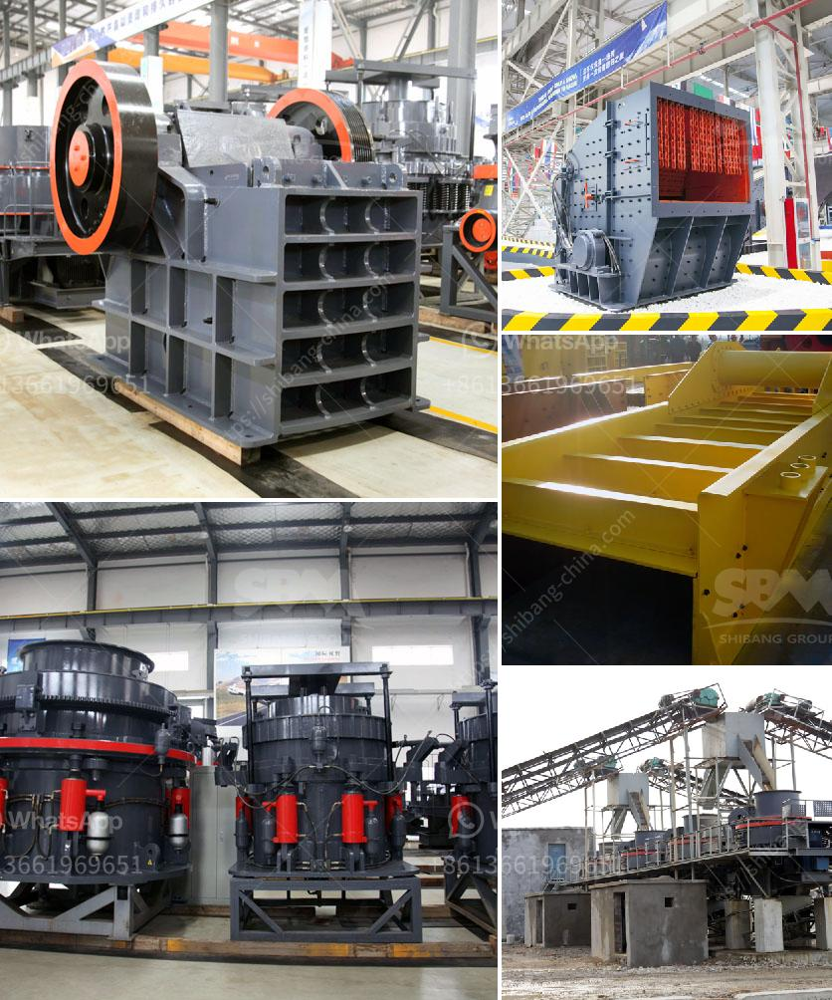

<h3>typical 100tph jaw crusher feed size</h3>
A jaw crusher is a primary crusher that utilizes compressive force to reduce material size to a smaller dimension. Feed size in a jaw crusher is typically defined by the dimensions of the top opening where material enters. The typical feed size for a jaw crusher is 100 tph. This is measured from the top of the crushing chamber to the bottom of the feed opening.

A 100 tph jaw crusher requires a feed opening of 900 mm x 650 mm for maintaining a desired feed size range, and hence a minimum discharge opening of 70 mm is required. Furthermore, a crusher's capacity depends on its crushing chamber design, which affects the material's compression and particle breakage.

In the case of a 100 tph jaw crusher, the maximum feed size is 630 mm, which translates to a maximum crushing ratio of approximately 6:1. This means that the crusher can accept material with a size up to 6 times the minimum discharge opening.

However, it is important to note that the ideal feed size for a jaw crusher may vary depending on the type of material being crushed. Hard and abrasive materials tend to require smaller feed sizes to prevent excessive wear on the crusher components. Conversely, soft and less abrasive materials can tolerate larger feed sizes.

In conclusion, a typical 100 tph jaw crusher accepts a feed size of 900 mm x 650 mm, with a minimum discharge opening of 70 mm. The maximum size of material accepted by the crusher is 630 mm, resulting in a maximum crushing ratio of approximately 6:1. However, it is advisable to consider the material's characteristics when determining the ideal feed size for a jaw crusher to ensure optimal performance and longevity of the crusher.
<h3>Contact us</h3><ul><li><strong>Whatsapp:&nbsp;<a href="https://wa.me/8613661969651">+8613661969651</a></strong></li><li><a href="https://swt.shibang-china.com/?git&amp;zhl&amp;typical 100tph jaw crusher feed size"><strong>Online Service(chat now)</strong></a></li></ul><h3>Related</h3><ul><li><a href='crusher machine philippine distributor and price.md'>crusher machine philippine distributor and price</a></li><li><a href='gold mining machine indonesia equipment nigeria.md'>gold mining machine indonesia equipment nigeria</a></li><li><a href='granite crusher machine philippines.md'>granite crusher machine philippines</a></li><li><a href='iron ore crushing equipment.md'>iron ore crushing equipment</a></li><li><a href='density of crushed hornfels basalt granite.md'>density of crushed hornfels basalt granite</a></li></ul>