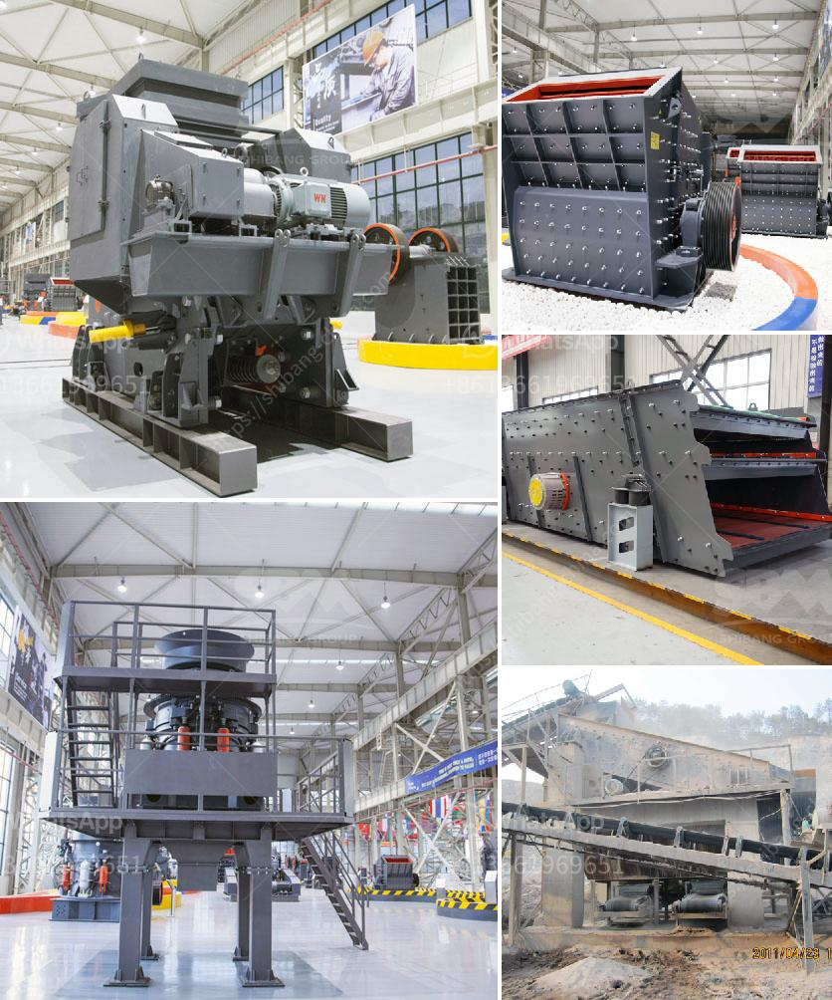

<h3>typical particle size of roll crusher</h3>
The roll crusher is a mechanical device that reduces the size of materials by squeezing and compressing them between two rotating, metal cylinders. These cylinders are known as rolls and utilize two parallel axes, providing a uniform gap between the rolls. The material is fed into the crusher, and as the rolls rotate, it is crushed against the rolls, producing smaller particles.

The typical particle size of a roll crusher varies depending on the gap setting between the rolls and the hardness of the material being crushed. This gap setting can be adjusted to control the product size. Generally, the smaller the gap, the finer the crushed product. However, this also depends on the specific characteristics of the material.

In general, roll crushers are capable of producing a wide range of particle sizes, ranging from several inches to as fine as a few microns. The ability to control the gap setting makes the roll crusher versatile for processing various materials and achieving different final product sizes.

The particle size distribution of the final product from a roll crusher is determined by the roll gap setting and the feed size. When the gap setting is narrower, smaller particles are produced, resulting in a narrower particle size distribution. On the other hand, a wider gap setting will produce larger particles and a broader particle size distribution.

The roll crusher is commonly used in the mining industry for ore crushing and in the construction industry for building material production. For example, in the mining industry, the roll crusher is used to crush materials such as coal, limestone, cement, and phosphate rock.

In terms of the typical particle size, a narrow gap setting of around 0.1-0.3 inches (2.5-7.6 mm) can produce particles ranging from about 2-10 mesh (about 10-2,000 microns). A wider gap setting, around 0.4-0.7 inches (10-18 mm), can produce particles ranging from about 4-14 mesh (about 4,000-1,400 microns). These are just general examples, and the actual particle size will vary depending on the specific material and roll crusher model.

It is important to note that the particle size distribution of the feed material to the roll crusher also affects the final product size. If the feed material has a wide particle size distribution, the resulting crushed product will likely have a broader particle size distribution as well.

In conclusion, the roll crusher is a versatile machine capable of producing a wide range of particle sizes. The typical particle size depends on the gap setting between the rolls and the characteristics of the material being crushed. Understanding the relationship between these factors is crucial for achieving the desired product size in various industries.
<h3>Contact us</h3><ul><li><strong>Whatsapp:&nbsp;<a href="https://wa.me/8613661969651">+8613661969651</a></strong></li><li><a href="https://swt.shibang-china.com/?git&amp;zhl&amp;typical particle size of roll crusher"><strong>Online Service(chat now)</strong></a></li></ul><h3>Related</h3><ul><li><a href='how to manufacture jaw crusher.md'>how to manufacture jaw crusher</a></li><li><a href='cost of cement manufacturing plant tons per day.md'>cost of cement manufacturing plant tons per day</a></li><li><a href='mining vibrating screen for sale.md'>mining vibrating screen for sale</a></li><li><a href='alluvial gold processing plant for small scale.md'>alluvial gold processing plant for small scale</a></li><li><a href='m sand manufacturing machine.md'>m sand manufacturing machine</a></li></ul>