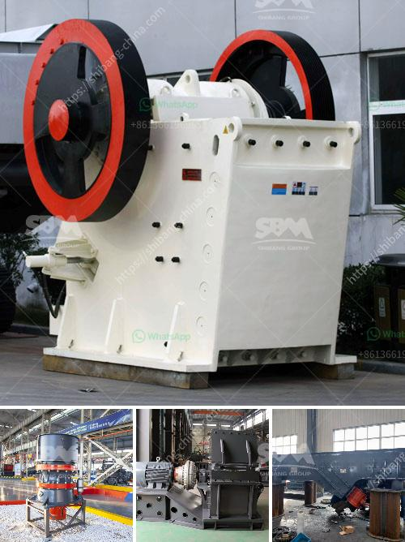

<h3>ultra fine grinding mill price</h3>
Ultra fine grinding mill, also known as ultra fine powder grinding mill, is a kind of Raymond mill. It is widely used in grinding process of mining materials in metallurgy,Shanghai Clirik is a professional ultra fine grinding mill manufacturer in China. If you want to achieve great success in your business, you should choose Clirik as your cooperative partner. Because Clirik not only provides customers with advanced technology and high-quality equipment, but also offers perfect after-sales service to solve your worries.

The price of ultra fine grinding mill is determined by various factors, including the model, size and manufacturer of the equipment. Clirik's ultra fine grinding mill has a complete model range, from 0.5 tons per hour to 45 tons per hour. Customers can choose the appropriate model according to their own production needs and investment budget. In addition, Clirik's ultra fine grinding mill has a compact structure, small footprint, convenient installation and maintenance, and low operating cost. Therefore, it is favored by many customers.

As for the price, Clirik's ultra fine grinding mill is relatively affordable. Compared with other grinding mills on the market, Clirik's ultra fine grinding mill has a higher cost performance ratio. The reason lies in the advanced technology and excellent manufacturing process of Clirik's equipment. Clirik always adheres to the principle of customer first, and provides customers with reliable and high-quality products at a reasonable price.

In conclusion, when selecting an ultra fine grinding mill, you should consider the model, size, manufacturer and price of the equipment. Clirik's ultra fine grinding mill is an ideal choice for grinding various non-metallic ores with Mohs hardness below 7 and humidity below 6%. Its price is reasonable, and it can bring considerable economic benefits to customers. If you have any grinding needs, please feel free to contact us, our professional team will provide you with a comprehensive solution.
<h3>Contact us</h3><ul><li><strong>Whatsapp:&nbsp;<a href="https://wa.me/8613661969651">+8613661969651</a></strong></li><li><a href="https://swt.shibang-china.com/?git&amp;zhl&amp;ultra fine grinding mill price"><strong>Online Service(chat now)</strong></a></li></ul><h3>Related</h3><ul><li><a href='how to make a roller mill.md'>how to make a roller mill</a></li><li><a href='sand and quarry importer in singapore.md'>sand and quarry importer in singapore</a></li><li><a href='ballast crushers in kenya.md'>ballast crushers in kenya</a></li><li><a href='small grinding mill machine in india.md'>small grinding mill machine in india</a></li><li><a href='small sized cement plant project cost in india.md'>small sized cement plant project cost in india</a></li></ul>