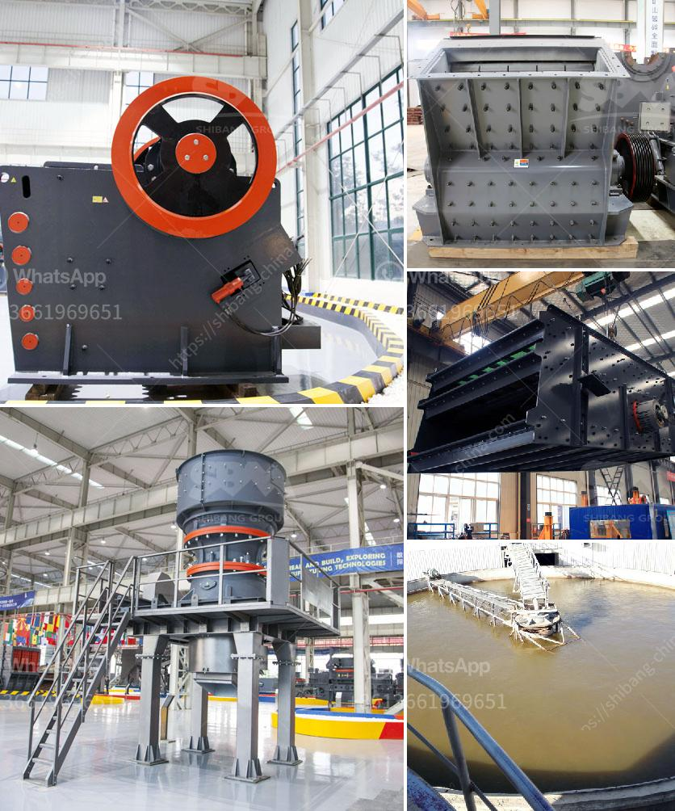

<h3>ultrafine grinding mill</h3>
In various industries, the demand for finer powder materials is increasing. As technology advances, traditional grinding mills are unable to meet the requirements of producing ultrafine powders. To cater to this market demand, a new type of ultrafine grinding mill has emerged. It is called ultrafine grinding mill, and its development greatly promotes the development of grinding industry.

The ultrafine grinding mill is a professional equipment for processing various ores and minerals. It has many advantages, such as superior performance, wide range of applications, low noise, energy-saving, and environmental protection. Compared with the traditional mill, the ultrafine grinding mill can grind the materials finer, with a particle size range of 300-3000 mesh, and has a large capacity.

The key feature of the ultrafine grinding mill is its high grinding efficiency and low power consumption. It can grind the materials into ultrafine powder, which greatly saves energy. In addition, the ultrafine grinding mill has a scientific and reasonable design structure, which ensures the stability and reliability of the equipment during operation. It effectively reduces the noise generated during the grinding process, creating a comfortable and quiet working environment.

The ultrafine grinding mill is suitable for grinding all kinds of non-flammable and explosive ores with Mohs hardness below 9.3 and humidity below 7%. It is widely used in industries such as metallurgy, building materials, chemicals, mining, and construction. With the continuous development of technology, the ultrafine grinding mill will play an increasingly important role in the production of ultrafine powders.

In conclusion, the ultrafine grinding mill is a highly efficient and energy-saving equipment for producing ultrafine powders. Its outstanding performance and wide range of applications make it an ideal choice for various industries. With the continuous improvement of technology, the ultrafine grinding mill will continue to innovate and develop, providing better solutions for the grinding industry.
<h3>Contact us</h3><ul><li><strong>Whatsapp:&nbsp;<a href="https://wa.me/8613661969651">+8613661969651</a></strong></li><li><a href="https://swt.shibang-china.com/?git&amp;zhl&amp;ultrafine grinding mill"><strong>Online Service(chat now)</strong></a></li></ul><h3>Related</h3><ul><li><a href='gold mining machines manufacturers from italy.md'>gold mining machines manufacturers from italy</a></li><li><a href='stone crusher vibrating screen manila.md'>stone crusher vibrating screen manila</a></li><li><a href='types of crushed aggregates in pakistan.md'>types of crushed aggregates in pakistan</a></li><li><a href='silica sand quarry for sale in tunisia in cork ireland.md'>silica sand quarry for sale in tunisia in cork ireland</a></li><li><a href='sand crusher for sale.md'>sand crusher for sale</a></li></ul>