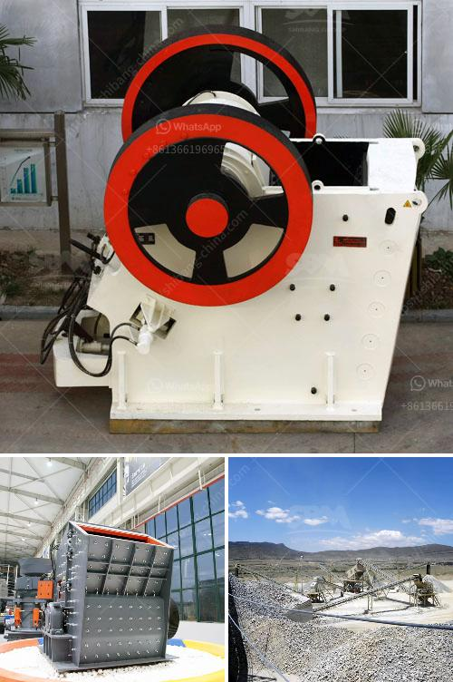

<h3>used 3 ft cone crusher</h3>
A 3 ft cone crusher is a type of crushing equipment used to crush hard stones into smaller sizes. It is commonly used in a variety of industries, including mining, metallurgy, construction, and quarrying. These machines are highly efficient, durable, and reliable, making them suitable for heavy-duty applications. In this article, we will explore the features, benefits, and potential applications of a used 3 ft cone crusher.

1. Crushing Capacity: The 3 ft cone crusher is capable of producing large amounts of uniformly sized aggregates. It has a robust design and can handle high volumes of materials efficiently. This ensures a steady supply of crushed stones for various construction and infrastructure projects.

2. Versatility: The cone crusher can be adjusted to produce different types of aggregates. By changing the settings, operators can achieve different particle sizes and shapes, depending on the specific requirements of the project. This versatility makes the 3 ft cone crusher suitable for a wide range of applications.

3. Easy Maintenance: Used cone crushers are relatively easy to maintain. They feature simple designs with fewer moving parts, reducing the risk of mechanical failures. Regular maintenance, such as lubricating the bearings and replacing worn-out parts, can significantly extend the lifespan of the equipment and ensure optimal performance.

4. Energy Efficiency: Cone crushers are more energy-efficient compared to traditional jaw crushers. The crushing process involves a circular crushing motion, which results in a higher reduction ratio. This means that less energy is required to break down the stones, reducing overall energy consumption and operating costs.

1. Mining Operations: Cone crushers are essential in mining operations as they help break down large rocks into smaller fragments. Whether it is coal, limestone, or iron ore, a 3 ft cone crusher can efficiently process the material, facilitating the extraction process.

2. Quarrying: Quarries use cone crushers to produce high-quality aggregates for construction purposes. The 3 ft cone crusher can crush various types of stones, including granite, limestone, basalt, and more, making it ideal for creating durable and reliable building materials.

3. Construction Projects: Cone crushers are widely used in construction projects as they provide a consistent supply of crushed stones. These stones are then used in road construction, building foundations, and concrete production. The uniformity and quality of the aggregates produced by a 3 ft cone crusher make it an essential tool in the construction industry.

A used 3 ft cone crusher is an excellent investment for businesses in need of reliable crushing equipment. With its crushing capacity, versatility, and easy maintenance, it can efficiently process various materials, making it a valuable addition to mining, quarrying, and construction operations. Whether you need to crush large rocks or produce high-quality aggregates, a 3 ft cone crusher is a durable and cost-effective solution.
<h3>Contact us</h3><ul><li><strong>Whatsapp:&nbsp;<a href="https://wa.me/8613661969651">+8613661969651</a></strong></li><li><a href="https://swt.shibang-china.com/?git&amp;zhl&amp;used 3 ft cone crusher"><strong>Online Service(chat now)</strong></a></li></ul><h3>Related</h3><ul><li><a href='stone portable crusher.md'>stone portable crusher</a></li><li><a href='mini concrete crushers for sale in america.md'>mini concrete crushers for sale in america</a></li><li><a href='cone crusher on rent in orissa.md'>cone crusher on rent in orissa</a></li><li><a href='about used stone crushers in america.md'>about used stone crushers in america</a></li><li><a href='small mobile gold grinding mill in philippines.md'>small mobile gold grinding mill in philippines</a></li></ul>