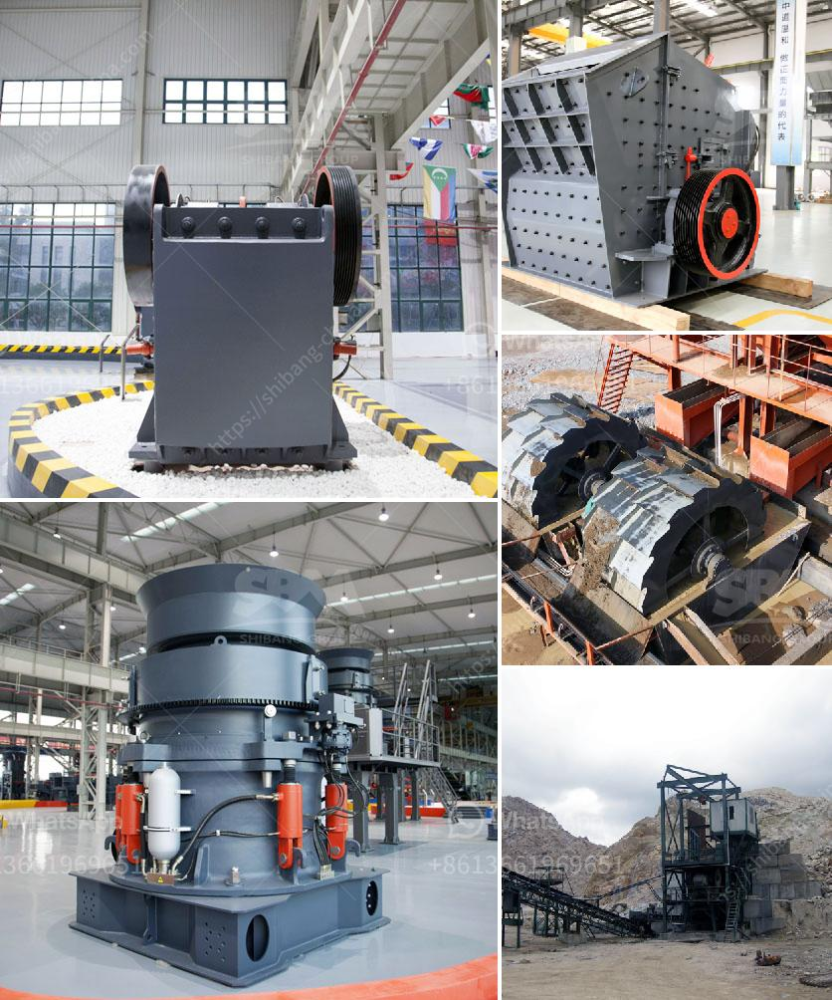

<h3>used ball mill in gujrat</h3>
The grinding operation is an essential step in the production process of various industries. It utilizes a special machinery called ball mill, which is prevalent in Gujarat, a state in India. Located on the western coast, Gujarat is home to several industries, including textiles, chemicals, pharmaceuticals, ceramics, and many more. These industries extensively rely on the use of ball mills to grind raw materials and reduce them into a fine powder.

A ball mill is a cylindrical drum filled with small or large grinding media, such as balls and pebbles. When the drum rotates, the media impacts and grinds the material into the desired size, making it suitable for further processing or direct utilization. Ball mills are commonly used in the manufacturing of cement plants, power generation plants, chemicals industries, and other production facilities. The versatility and efficiency of ball mills make them a crucial machine in various sectors.

In Gujarat, there is a thriving market for used ball mills. These are either imported from other countries or sourced domestically from industries that no longer require them. The availability of used ball mills offers cost-saving benefits for businesses seeking to invest in grinding machinery. Importing a new ball mill can be expensive, whereas buying a used one can achieve the same results at a lower cost. This makes used ball mills a preferred choice for small and medium-sized enterprises looking to enhance their production capabilities.

One of the key advantages of used ball mills in Gujarat is their ability to deliver consistent and reliable performance. These machines have been previously tested and proven in their field of operation. Their quality is guaranteed, making them a trustworthy option for industrial applications. Moreover, used ball mills in Gujarat are often refurbished or reconditioned, ensuring that they are in good working condition before being sold to potential buyers. This refurbishment process involves inspecting, cleaning, repairing, and replacing any worn-out or faulty components. As a result, the used ball mills are as good as new, providing reliable and efficient grinding performance.

The demand for used ball mills in Gujarat is driven by the state's industrial growth and development. As more industries are established, the need for grinding equipment increases. Buying used ball mills not only saves money but also contributes to sustainable practices by prolonging the lifespan of existing machinery. Additionally, the availability of used ball mills creates a circular economy by reducing waste and promoting recycling in the manufacturing industry.

In conclusion, used ball mills play a vital role in Gujarat's industries by providing cost-effective grinding solutions for various applications. Their availability and reliable performance make them a preferred choice for businesses seeking to enhance their production capabilities while keeping costs in check. Buying used ball mills not only offers financial benefits but also contributes to sustainable practices in the manufacturing sector. As Gujarat continues to flourish as an industrial hub, the demand for used ball mills is expected to rise, providing opportunities for businesses to access efficient grinding machinery at a fraction of the cost.
<h3>Contact us</h3><ul><li><strong>Whatsapp:&nbsp;<a href="https://wa.me/8613661969651">+8613661969651</a></strong></li><li><a href="https://swt.shibang-china.com/?git&amp;zhl&amp;used ball mill in gujrat"><strong>Online Service(chat now)</strong></a></li></ul><h3>Related</h3><ul><li><a href='washing powder production line.md'>washing powder production line</a></li><li><a href='silica iron ore silver seperation machine.md'>silica iron ore silver seperation machine</a></li><li><a href='coal charcoal crushing grinding machine small.md'>coal charcoal crushing grinding machine small</a></li><li><a href='jaw stone crushers in usa.md'>jaw stone crushers in usa</a></li><li><a href='conveyor belts for sale philippines.md'>conveyor belts for sale philippines</a></li></ul>