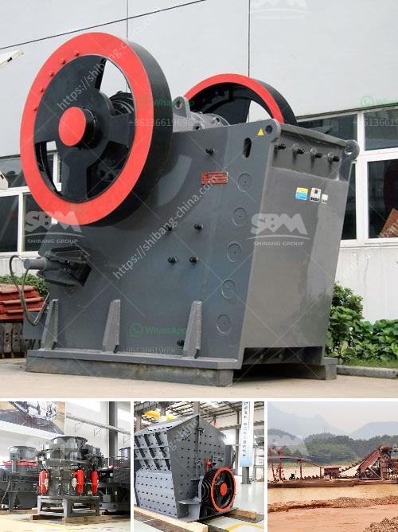

<h3>used ball mill machine capacity in indonesia</h3>
Indonesia, known for its stunning landscapes and rich cultural heritage, is also home to a thriving industrial sector. One vital component of this sector is the mining industry, which extensively relies on machinery like ball mills to process ore materials effectively. Understanding the capacity of used ball mill machines available in the country is crucial for mining companies to optimize their operations and maximize profits. This article will explore the significance of capacity in used ball mill machines in Indonesia.

Capacity refers to the maximum amount of material that a ball mill can process within a given time frame. It is measured in terms of tonnage per hour—a higher capacity means the mill can handle a more substantial amount of materials. Choosing the appropriate ball mill capacity is critical to ensure the efficient processing of ore materials and maintain the profitability of mining operations.

1. Size of the Mill: The physical dimensions of the mill, including its length, diameter, and volume, directly impact its capacity. A larger mill can typically handle more materials at a time, thus increasing the processing capacity.

2. Speed of Rotation: The rotational speed of the mill significantly affects its performance. Higher speeds allow for faster and more efficient grinding, leading to increased capacity.

3. Ore Hardness: The hardness of the processed material affects the grinding ability of the mill. Harder ores may require more energy to be crushed, reducing the overall capacity of the mill.

4. Ball Size and Composition: The size and type of balls used in the ball mill also impact capacity. Smaller, denser balls improve grinding efficiency and increase capacity.

Mining companies in Indonesia often consider purchasing used ball mill machines due to their numerous advantages:

1. Cost Efficiency: Used ball mill machines are more budget-friendly compared to investing in new equipment, allowing companies to allocate their financial resources more effectively.

2. Reduced Downtime: Used ball mills are readily available and can be quickly integrated into existing mining operations, minimizing downtime and ensuring continuous production.

3. Sustainability: By opting for used machinery, companies contribute to reducing e-waste and promote a more sustainable approach to mining operations.

4. Familiarity and Reliability: Used ball mill machines have a proven track record, as their performance and reliability have been tested in actual mining environments.

The capacity of used ball mill machines plays a vital role in the success and profitability of mining operations in Indonesia. By considering the size, speed, ore hardness, and composition of the balls, mining companies can choose the most suitable machinery to optimize their ore processing capabilities. Investing in used ball mill machines offers numerous benefits, including cost efficiency, reduced downtime, sustainability, and reliability. As the demand for minerals continues to rise, harnessing the full capacity of these machines is key to meeting production targets and maintaining a competitive edge in the Indonesian mining industry.
<h3>Contact us</h3><ul><li><strong>Whatsapp:&nbsp;<a href="https://wa.me/8613661969651">+8613661969651</a></strong></li><li><a href="https://swt.shibang-china.com/?git&amp;zhl&amp;used ball mill machine capacity in indonesia"><strong>Online Service(chat now)</strong></a></li></ul><h3>Related</h3><ul><li><a href='china gold processing mills.md'>china gold processing mills</a></li><li><a href='how to set up crusher.md'>how to set up crusher</a></li><li><a href='crusher price in kazakhstan.md'>crusher price in kazakhstan</a></li><li><a href='36 jaw crusher for rent edmonton.md'>36 jaw crusher for rent edmonton</a></li><li><a href='chrome washing plant for sale south africa.md'>chrome washing plant for sale south africa</a></li></ul>