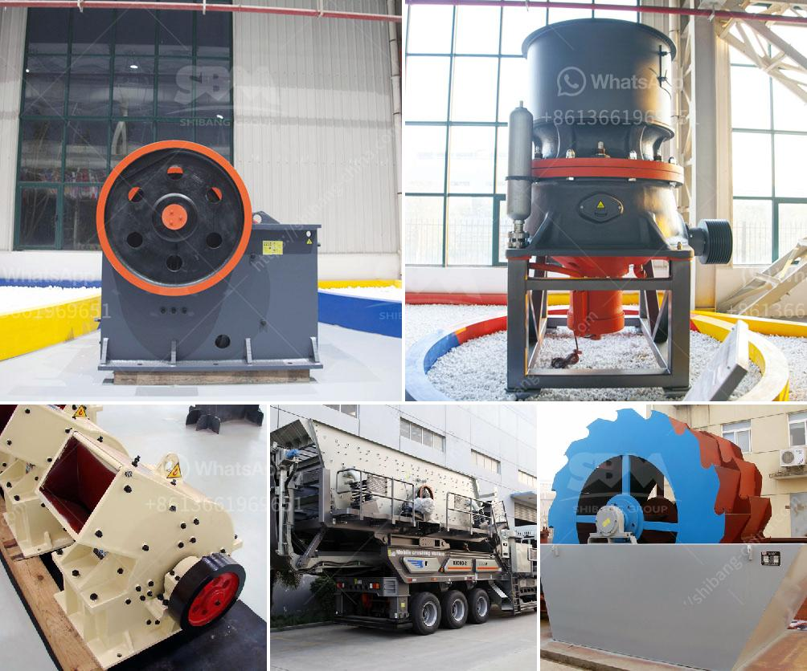

<h3>used calcite powder plant and machinery</h3>
Calcite is a mineral composed of calcium carbonate (CaCO3), making it one of the most abundant minerals on Earth. This versatile mineral has various applications, including as a filler, coating agent, and pigment. The demand for calcite powder has been on the rise, leading to the development of used calcite powder plant and machinery.

The used calcite powder plant and machinery are essential components in the production of calcite powder. These machines operate through advanced technology and are designed to meet the increasing demand for calcite powder. By utilizing used machinery, one can reduce costs without compromising productivity or quality.

One of the main benefits of using used calcite powder plant and machinery is its cost-effectiveness. Used machinery is often available at a fraction of the price of new machines, allowing businesses to save money on their initial investment. Additionally, by purchasing used machinery, companies can avoid the lengthy lead time associated with ordering new equipment.

Another advantage of utilizing used calcite powder plant and machinery is their reliability. These machines have already been tested in real-world production environments, ensuring that they can withstand the demands of continuous operation. As such, businesses can have confidence in their ability to produce calcite powder without frequent breakdowns or interruptions.

Furthermore, by investing in used machinery, companies can reduce their environmental impact. By giving these machines a second life, businesses contribute to the sustainable use of resources and promote a circular economy. It also avoids the need for additional extraction and manufacturing processes required for the production of new machines.

In conclusion, the use of used calcite powder plant and machinery provides businesses with an economical and reliable solution for the production of calcite powder. By minimizing costs and maximizing productivity, companies can effectively meet the increasing demand for this versatile mineral. Additionally, the utilization of used machinery promotes sustainability, contributing to a greener future.
<h3>Contact us</h3><ul><li><strong>Whatsapp:&nbsp;<a href="https://wa.me/8613661969651">+8613661969651</a></strong></li><li><a href="https://swt.shibang-china.com/?git&amp;zhl&amp;used calcite powder plant and machinery"><strong>Online Service(chat now)</strong></a></li></ul><h3>Related</h3><ul><li><a href='raymond mill manufacturers in.md'>raymond mill manufacturers in</a></li><li><a href='limestone micronizer machine limestone micronizer mill.md'>limestone micronizer machine limestone micronizer mill</a></li><li><a href='about used stone crushers in america.md'>about used stone crushers in america</a></li><li><a href='dolomite grinding roller mill manufacturers india.md'>dolomite grinding roller mill manufacturers india</a></li><li><a href='stone crushing plant for sale in pakistan.md'>stone crushing plant for sale in pakistan</a></li></ul>