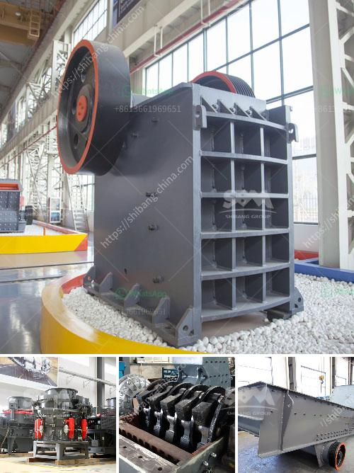

<h3>used cement plant for sale germany</h3>
Germany, known for its precision engineering and high-quality products, has long been a global leader in industrial manufacturing. Today, it presents a unique opportunity for investors and industry players in the used cement plant market. With a rich infrastructure heritage and a sustainable focus on development, Germany offers a solid foundation for those seeking to acquire state-of-the-art cement production facilities at competitive rates. In this article, we will explore the reasons behind Germany's vibrant used cement plant market and the benefits it presents.

Germany's industrial landscape is steeped in a legacy of engineering excellence that has earned it a reputation as the industrial powerhouse of Europe. Over the years, the country has nurtured a highly skilled workforce and developed an advanced technical infrastructure capable of producing top-notch cement manufacturing equipment. As a result, Germany's now has an abundance of used cement plants available for sale.

Purchasing a used cement plant offers several advantages over building a new facility. Firstly, cost savings are a significant factor. The prices of used cement plants in Germany are considerably lower than the cost of new plants, making it an attractive investment opportunity for those looking to enter the cement industry or expand their existing operations. By acquiring quality-used equipment, investors can enjoy substantial savings while maintaining high production standards.

Used cement plants from Germany are often equipped with the latest technological advancements, which enable efficient and eco-friendly cement production. Germany is known for its commitment to sustainable practices, and this approach has trickled down to the industrial sector, including cement manufacturing. By acquiring a used cement plant from Germany, investors can capitalize on cutting-edge technology and adhere to environmental regulations, thus contributing to a greener future.

Another advantage of purchasing a used cement plant in Germany is the industry expertise available in the country. Germany boasts a vast pool of highly skilled and experienced engineers, technicians, and craftsmen who are well-versed in cement production processes. The presence of such technical talent can significantly aid smooth plant installation, commissioning, and post-sale support. Investors can tap into this exceptional knowledge base, ensuring a seamless transition and successful operation of the acquired cement plant.

Germany's flourishing used cement plant market presents an exciting prospect for investors and industry players looking to enter or expand in the cement industry. With a renowned legacy of industrial excellence, advanced technological advancements, sustainable practices, and skilled workforce, Germany offers cost-effective investment opportunities for acquiring top-quality used cement plants. By capitalizing on the country's expertise, investors can ensure a smooth transition and maximize the operational efficiency of their plants. With Germany's focus on sustainable development, purchasing a used cement plant is not only a financially advantageous decision but also an environmentally responsible one. As the country continues to thrive as an industrial powerhouse, now is the perfect time to explore the opportunities offered by Germany's used cement plant market.
<h3>Contact us</h3><ul><li><strong>Whatsapp:&nbsp;<a href="https://wa.me/8613661969651">+8613661969651</a></strong></li><li><a href="https://swt.shibang-china.com/?git&amp;zhl&amp;used cement plant for sale germany"><strong>Online Service(chat now)</strong></a></li></ul><h3>Related</h3><ul><li><a href='crushing machine for ceramic raw materials.md'>crushing machine for ceramic raw materials</a></li><li><a href='mini crushing plant for sale.md'>mini crushing plant for sale</a></li><li><a href='calculation coal crusher.md'>calculation coal crusher</a></li><li><a href='raymond mill manufacturers in.md'>raymond mill manufacturers in</a></li><li><a href='marble crusher supplier.md'>marble crusher supplier</a></li></ul>