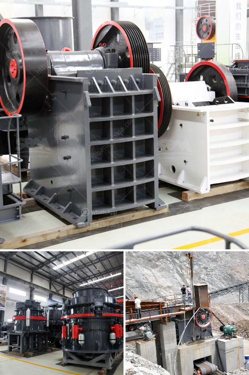

<h3>used conveyor belt in kenya</h3>
In today's competitive business landscape, companies are constantly seeking innovative ways to streamline their operations and reduce costs. One area where this is particularly evident is in the field of material handling, where industries are turning to used conveyor belts as a cost-effective solution. Kenya, a rapidly developing country with a thriving manufacturing and construction sector, is no exception.

Used conveyor belts provide an economical alternative to buying new ones, especially for companies that require a continuous flow of materials or goods. These belts, which are typically sourced from industries that no longer have a need for them, offer several advantages over new belts. Firstly, the cost savings are undeniable. Used conveyor belts are often available at a fraction of the cost of new ones, allowing businesses to acquire them without stretching their budgets too far.

Additionally, used conveyor belts in Kenya offer a sustainable and environmentally-friendly solution. By recycling and reusing these belts, companies contribute to reducing waste and resource consumption. This eco-conscious approach aligns with the global trend towards sustainable practices. Consequently, businesses that adopt used conveyor belts can enhance their brand image and appeal to environmentally-conscious customers.

Moreover, used conveyor belts are readily available in the Kenyan market, both in local classified ads and through online platforms. This accessibility makes it easier for businesses in need of conveyor belts to source them quickly, thereby minimizing any operational downtime. Additionally, the selection of used conveyor belts in Kenya is often extensive, allowing companies to find belts that meet their specific requirements, whether it be in terms of size, material, or design.

It is important to note, however, that when purchasing used conveyor belts, businesses should conduct a thorough examination to ensure they meet the necessary safety standards. Regular maintenance and inspections should also be performed to ensure that the belts are in optimal working condition. Consulting with experienced professionals in material handling systems can provide valuable guidance on these matters.

In conclusion, the utilization of used conveyor belts in Kenya presents a practical, economical, and environmentally-friendly solution for companies in need of material handling equipment. With their lower cost, wide availability, and potential for sustainable branding, used conveyor belts offer immense value to businesses across various industries. By embracing these cost-effective alternatives, Kenyan companies can improve their operational efficiency, reduce their environmental impact, and gain a competitive edge in the market.
<h3>Contact us</h3><ul><li><strong>Whatsapp:&nbsp;<a href="https://wa.me/8613661969651">+8613661969651</a></strong></li><li><a href="https://swt.shibang-china.com/?git&amp;zhl&amp;used conveyor belt in kenya"><strong>Online Service(chat now)</strong></a></li></ul><h3>Related</h3><ul><li><a href='marble crusher supplier.md'>marble crusher supplier</a></li><li><a href='how to manufacture jaw crusher.md'>how to manufacture jaw crusher</a></li><li><a href='crusher stone crusher 10x20.md'>crusher stone crusher 10x20</a></li><li><a href='price of recycling equipment in italy.md'>price of recycling equipment in italy</a></li><li><a href='hammer mill for quartz rock.md'>hammer mill for quartz rock</a></li></ul>