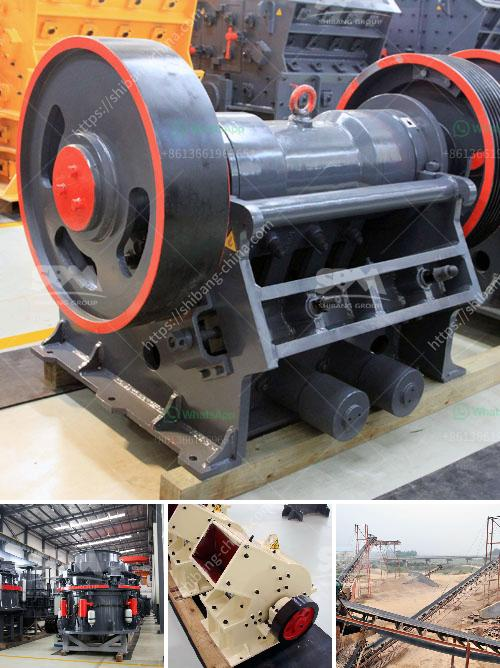

<h3>used crusher price in uk</h3>
The market for used crushers in the UK has been growing steadily over the years. As more companies and individuals recognize the benefits of purchasing used equipment, the demand for used crushers has surged. This has resulted in a wide variety of options available in the market, offering buyers a range of alternatives to choose from.

One of the key factors that attract buyers to used crushers is the relatively lower price compared to brand new machines. Used crushers are typically priced at a fraction of the cost of their new counterparts, making them a cost-effective choice for businesses and individuals operating on a limited budget.

The price range for used crushers in the UK can vary greatly depending on various factors such as the age, condition, and model of the crusher. Generally, prices for used crushers in the UK fall within the range of £10,000 to £60,000. However, it is important to note that these prices are just rough estimates and can be significantly lower or higher depending on the specific circumstances.

The price variation in used crushers is influenced by a number of factors. One of the most significant factors is the age of the crusher. Older crushers, especially those that have been well-maintained and are in good working condition, tend to command a higher price.

Another factor that affects the price of used crushers is the brand and model. Well-known brands with a reputation for quality and reliability, such as Sandvik or Metso, are likely to have higher price tags compared to lesser-known or generic brands.

Additionally, the level of wear and tear on the crusher also impacts its price. Crushers that have been used extensively and show signs of heavy wear and tear may be priced lower compared to those that have been lightly used and are in better condition.

Ultimately, the price of a used crusher in the UK is determined by a combination of factors, including age, condition, brand, and model. Potential buyers should carefully consider these factors and thoroughly inspect any used crusher they are considering purchasing to ensure they are getting a machine that meets their requirements and offers good value for their investment.
<h3>Contact us</h3><ul><li><strong>Whatsapp:&nbsp;<a href="https://wa.me/8613661969651">+8613661969651</a></strong></li><li><a href="https://swt.shibang-china.com/?git&amp;zhl&amp;used crusher price in uk"><strong>Online Service(chat now)</strong></a></li></ul><h3>Related</h3><ul><li><a href='were to buy old rock crusher.md'>were to buy old rock crusher</a></li><li><a href='packing plant in cement industry.md'>packing plant in cement industry</a></li><li><a href='the price of a ball mill in india.md'>the price of a ball mill in india</a></li><li><a href='sizing jaw crusher.md'>sizing jaw crusher</a></li><li><a href='silica sand mines in philippines.md'>silica sand mines in philippines</a></li></ul>