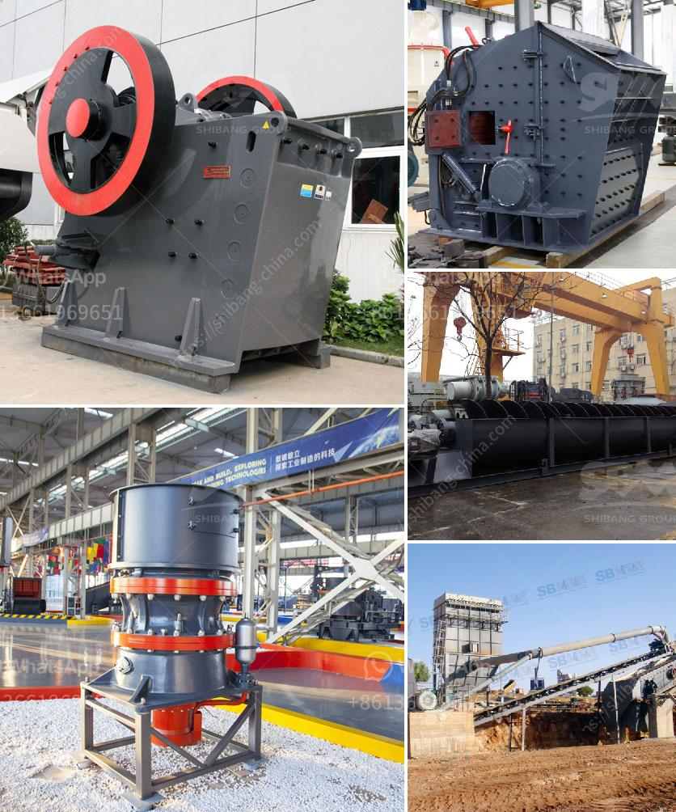

<h3>used crusher stone sale tanzania</h3>
Tanzania, a country endowed with rich natural resources, has experienced significant growth in its construction industry in recent years. The demand for crushed stones, commonly used in the construction of roads, buildings, and other infrastructure projects, has also increased concurrently. As a result, the market for used crusher stones has seen a surge in popularity in Tanzania. This article delves into the advantages of purchasing used crusher stones and highlights why it is an excellent option for buyers in the country.

One of the primary benefits of purchasing used crusher stones in Tanzania is cost-effectiveness. Compared to new stones, which tend to be pricier due to their untouched condition, used stones are considerably more affordable. This affordability makes them an attractive option for construction companies, contractors, and individuals looking to complete their projects within a budget. By opting for used crusher stones, buyers can save a significant amount of money, making their construction projects more financially viable.

Another advantage of purchasing used crusher stones is the immediate availability they offer. Construction projects often encounter unexpected delays, and the need for additional stones may arise to meet tight deadlines. In such scenarios, acquiring used crusher stones becomes a convenient option as they are readily available on the market. This availability eliminates the waiting time commonly associated with sourcing new stones, ensuring the project progresses smoothly without any interruption.

Used crusher stones come in various shapes, sizes, and types, which allows buyers to choose the best-suited materials for their specific construction needs. Whether it be fine gravel or larger rocks, the availability of a diverse range of options enables buyers to find the perfect match for their project requirements. Furthermore, as stones used in crushers are typically made from durable materials such as basalt or granite, buyers can be assured of their quality and reliability.

Apart from the economic advantages, purchasing used crusher stones also reduces the environmental impact associated with new stone production. Crushing and quarrying operations to obtain new stones often entail significant energy consumption and cause emission of harmful substances into the environment. By reusing existing stones, the demand for new stone production is reduced, contributing to sustainability efforts and conservation of natural resources.

The increased demand for used crusher stones in Tanzania has led to the growth of a thriving market for sellers and suppliers. This presents an excellent opportunity for businesses specializing in stone crushers, as they can expand their operations to support the growing demand. Such growth not only benefits the businesses themselves but also drives economic development within the community by creating employment opportunities and generating revenue.

In conclusion, the purchase of used crusher stones in Tanzania offers numerous benefits for construction companies, contractors, and individuals alike. The cost-effectiveness, immediate availability, diverse range of options, reduced environmental impact, and potential for business growth make them a compelling choice for construction projects in the country. As Tanzania continues to experience growth in its construction sector, the market for used crusher stones is expected to remain robust, providing a crucial solution for all stakeholders involved.
<h3>Contact us</h3><ul><li><strong>Whatsapp:&nbsp;<a href="https://wa.me/8613661969651">+8613661969651</a></strong></li><li><a href="https://swt.shibang-china.com/?git&amp;zhl&amp;used crusher stone sale tanzania"><strong>Online Service(chat now)</strong></a></li></ul><h3>Related</h3><ul><li><a href='conveyor belts for sale philippines.md'>conveyor belts for sale philippines</a></li><li><a href='ballast crushing equipment in kenya.md'>ballast crushing equipment in kenya</a></li><li><a href='conveyor belt manufacturers in africa.md'>conveyor belt manufacturers in africa</a></li><li><a href='qurry crusher plant capacity.md'>qurry crusher plant capacity</a></li><li><a href='2000 kilos hammer mill.md'>2000 kilos hammer mill</a></li></ul>