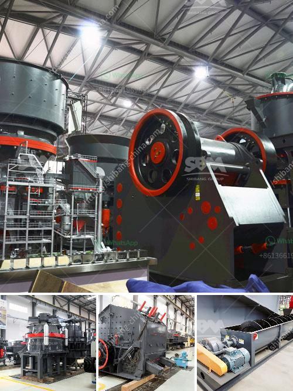

<h3>used crushers in america</h3>
Crushers play a vital role in the construction industry by reducing the size of large rocks into manageable aggregates. In America, the demand for crushers has been steadily increasing due to the growth of infrastructure projects. However, as environmental concerns mount, the focus has shifted towards using used crushers as a sustainable solution.

One of the key advantages of used crushers is their cost-effectiveness. As construction companies strive to stay within budget, purchasing a used crusher allows them to get the required machinery at a fraction of the cost of a new one. This not only contributes to significant savings but also enables businesses to allocate their resources more efficiently.

Another benefit lies in the availability of a wide range of used crushers in America. With the growing popularity of sustainable construction practices, many construction companies have recognized the importance of recycling and reusing materials. Consequently, the market for used crushers has expanded, offering various options that cater to specific project requirements.

Moreover, using used crushers aligns with the principles of sustainability. By opting for second-hand machinery, construction companies actively promote the reduction of waste and the preservation of natural resources. The reconditioned crushers, which are often in excellent condition, continue to perform effectively, bringing years of service to new projects without compromising on quality.

The rise in demand for used crushers has also triggered the growth of specialized companies that refurbish and resell these machines. These companies carefully inspect and repair the crushers, ensuring that the equipment adheres to high industry standards. This refurbishment process not only extends the lifespan of the crushers but also ensures their reliability on the construction site.

As construction companies in America strive to implement sustainable practices, the utilization of used crushers emerges as a remarkable solution. By investing in second-hand machinery, businesses can benefit from cost savings, a wide variety of options, and reduced environmental impact. With a growing network of specialized companies that refurbish and resell crushers, the availability of used machinery has become easier than ever. So, whether it's a large-scale infrastructure project or a small-scale development, the incorporation of used crushers contributes to a more sustainable and efficient construction industry in America.
<h3>Contact us</h3><ul><li><strong>Whatsapp:&nbsp;<a href="https://wa.me/8613661969651">+8613661969651</a></strong></li><li><a href="https://swt.shibang-china.com/?git&amp;zhl&amp;used crushers in america"><strong>Online Service(chat now)</strong></a></li></ul><h3>Related</h3><ul><li><a href='hammer mill edipesa.md'>hammer mill edipesa</a></li><li><a href='stone crusher machine factory in cambodia.md'>stone crusher machine factory in cambodia</a></li><li><a href='crusher hammer crusher price for stone.md'>crusher hammer crusher price for stone</a></li><li><a href='concrete crusher for sale used in canada.md'>concrete crusher for sale used in canada</a></li><li><a href='roll crushers for sale.md'>roll crushers for sale</a></li></ul>