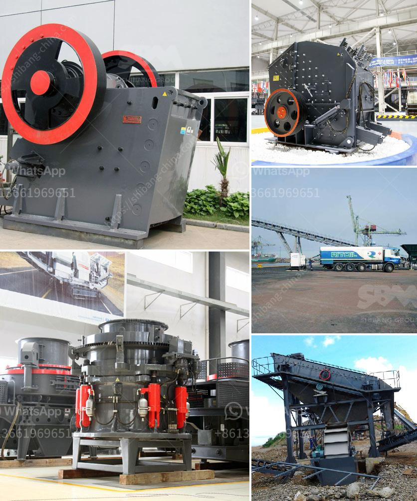

<h3>used ft crusher for sale</h3>
If you are in the market for a high-quality, durable crusher, look no further than a used FT crusher. Whether you are in the mining, construction, or recycling industry, this machine is designed to crush a wide variety of materials efficiently and effectively.

When buying a used FT crusher, there are a few key factors to consider. Firstly, you need to determine the size and type of material the machine will be handling. FT crushers come in different sizes and configurations, so it's important to choose one that meets your specific needs.

Additionally, it is crucial to examine the condition of the used crusher. Ensure that all parts are in good working order and that there is no excessive wear or damage. Inspecting the machine thoroughly will help you avoid any unexpected maintenance costs in the long run.

One advantage of purchasing a used FT crusher is the cost savings compared to buying new. Used crushers are typically priced lower, making them a more cost-effective option for businesses looking to expand their operations or replace outdated equipment. However, even though the price may be lower, quality is not compromised. FT crushers are known for their reliability and longevity, providing excellent value for money.

Another benefit of purchasing a used FT crusher is the availability. While new models may have wait times due to manufacturing processes, used crushers can be readily available on the market. This means you can begin using your crusher much sooner, minimizing downtime and maximizing productivity.

In conclusion, a used FT crusher is an excellent investment for businesses looking to enhance their material crushing capabilities. With careful consideration of the size, condition, and price, you can find a crusher that meets your requirements without breaking the bank. So, why wait? Start exploring the market for a used FT crusher today and take your operations to the next level.
<h3>Contact us</h3><ul><li><strong>Whatsapp:&nbsp;<a href="https://wa.me/8613661969651">+8613661969651</a></strong></li><li><a href="https://swt.shibang-china.com/?git&amp;zhl&amp;used ft crusher for sale"><strong>Online Service(chat now)</strong></a></li></ul><h3>Related</h3><ul><li><a href='pebbel stone crusher.md'>pebbel stone crusher</a></li><li><a href='second hand conveyor belt adelaide.md'>second hand conveyor belt adelaide</a></li><li><a href='gypsum crusher in salalah oman.md'>gypsum crusher in salalah oman</a></li><li><a href='automatic feeder for ball mill customer case.md'>automatic feeder for ball mill customer case</a></li><li><a href='coal pulverisers machines.md'>coal pulverisers machines</a></li></ul>