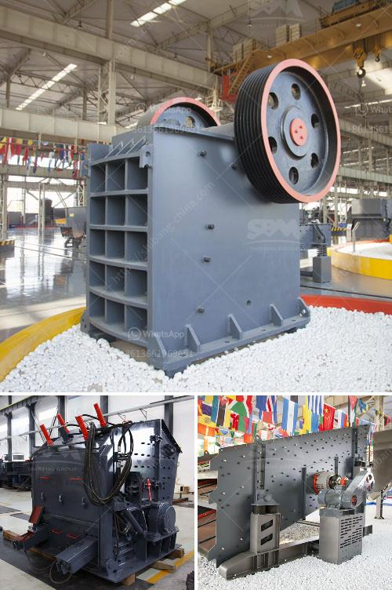

<h3>used grinding mills in nigeria</h3>
In today's industrial sector, grinding mills play a critical role in transforming raw materials into fine powders and flakes, which are essential for a multitude of industries including the food and beverage, pharmaceutical, cement, fertilizer, paint, ceramic, and chemical industries. Nigeria, as a developing country, heavily relies on the importation of machinery, including grinding mills. However, with the substantial availability of used grinding mills, Nigeria can save both money and resources while boosting its domestic food production and industrial capabilities.

For the food industry, grinding mills are vital for the production of various food items, such as flour, cornmeal, and cocoa powder. These products serve as key ingredients in many local delicacies and commercial food production. By utilizing used grinding mills, Nigeria can reduce its reliance on imported machinery, ultimately reducing costs and increasing the affordability of food products for consumers.

The pharmaceutical industry in Nigeria also heavily relies on grinding mills for the production of pharmaceutical powders, granules, and capsules. These pharmaceutical products are essential for meeting the healthcare needs of the growing Nigerian population. By investing in used grinding mills, Nigeria can enhance its pharmaceutical production capacity, ensuring the availability of important medications and contributing to improved healthcare outcomes.

In addition to the food and pharmaceutical industries, grinding mills are crucial for the production of building materials. The construction industry in Nigeria is rapidly growing, demanding a significant supply of cement and other materials. Grinding mills are used to pulverize limestone, clay, and other raw materials into a fine powder, which is then used to produce cement. By adopting used grinding mills, Nigeria can reduce its dependence on imported cement, ensuring a steady supply for construction projects and driving the growth of the local construction industry.

Moreover, used grinding mills can also be utilized in the production of paints, fertilizers, ceramics, and chemicals. These industries are vital for economic growth and diversification, offering employment opportunities and generating revenue. Thus, investing in used grinding mills can foster the development of these industries, boost productivity, and contribute to Nigeria's industrial self-sufficiency.

While importing new grinding mills may seem like a more desirable option, there are several reasons why opting for used mills is beneficial for Nigeria. Firstly, used grinding mills are generally cheaper than their new counterparts, allowing for cost savings in the initial investment. This affordability empowers small and medium-sized businesses to expand their operations and contribute to the country's economic growth.

Secondly, the availability of used grinding mills saves precious resources. Instead of producing new machinery, which requires raw materials and energy, Nigeria can utilize existing mills. This approach aligns with sustainable development goals and supports environmental conservation efforts.

Lastly, the adoption of used grinding mills promotes a circular economy by extending the lifespan of machinery. Rather than discarding mills that are no longer needed by their initial owners, they can be recycled and put to work in Nigeria. This reduces waste and ensures the efficient utilization of resources.

In conclusion, used grinding mills in Nigeria offer a vital resource for food production and various industries. By investing in this machinery, Nigeria can reduce importation costs, foster economic growth, and enhance industrial self-sufficiency. Moreover, the utilization of used mills contributes to sustainable development by conserving resources and promoting a circular economy. Hence, it is critical for the Nigerian government and relevant stakeholders to recognize the value of used grinding mills and take steps to promote their adoption in the country's industrial sector.
<h3>Contact us</h3><ul><li><strong>Whatsapp:&nbsp;<a href="https://wa.me/8613661969651">+8613661969651</a></strong></li><li><a href="https://swt.shibang-china.com/?git&amp;zhl&amp;used grinding mills in nigeria"><strong>Online Service(chat now)</strong></a></li></ul><h3>Related</h3><ul><li><a href='ballast quarry crusher machines.md'>ballast quarry crusher machines</a></li><li><a href='belt conveyor system manufacturers.md'>belt conveyor system manufacturers</a></li><li><a href='impact crushing machine price.md'>impact crushing machine price</a></li><li><a href='crusher machine to make crushed sand from mm.md'>crusher machine to make crushed sand from mm</a></li><li><a href='how to make ball mill pdf.md'>how to make ball mill pdf</a></li></ul>