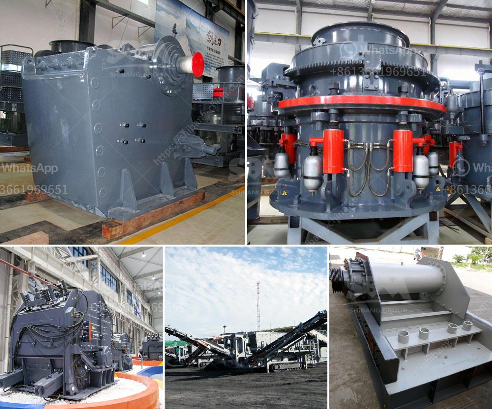

<h3>used jaw crusher for sale</h3>
In today's era of technological advancement, jaw crushers are widely used for different purposes. The jaw crusher industry has seen a spike in demand over the past few years due to the growing construction and infrastructure projects. These crushers are used for crushing large rocks, stones, and ores into smaller particles to be utilized in the construction process. 

Given the high cost of new jaw crushers, used jaw crushers have emerged as a cost-efficient alternative for rock crushing. A used jaw crusher for sale is an option worth considering when a smaller size of particle is required or when there is a lower budget limit. The crusher is available in different configurations to meet varied crushing needs.

One of the benefits of used jaw crushers is their low cost. Buying used jaw crushers can be a great way to save money in comparison to buying new crushers. Used equipment tends to be more affordable, allowing you to expand your crushing capacities without breaking the bank. It also allows you to allocate your resources more effectively, investing the saved money in other areas of your business.

Moreover, used jaw crushers come with the added advantage of being readily available. While new crushers may require a waiting period for manufacturing and delivery, used crushers can be obtained almost immediately. This quick availability ensures that there is no delay in your projects, and your productivity remains unaffected.

When purchasing a used jaw crusher, it is important to inspect the equipment properly. Look for any signs of wear and tear and ensure that all components are in good working condition. Evaluate the level of maintenance that the crusher has received in the past. Consider the age of the crusher and any potential limitations it may have due to wear and tear. Consulting with a trusted dealer or professional can assist you in making an informed decision.

It is also crucial to consider the specific requirements of your project before finalizing the purchase. Different crushers have varying capabilities, such as the ability to handle different types of materials or adjust the size of the output particle. By evaluating your crushing needs, you can choose a used jaw crusher that meets your specific requirements and optimizes your production process.

The purchase of a used jaw crusher for sale can be a wise investment for businesses in the construction, mining, and quarrying industries. Novice buyers may find it challenging to navigate the used equipment market. However, with careful research and attention to detail, you can acquire a high-quality jaw crusher that will serve your business for years to come.

In conclusion, used jaw crushers offer a cost-efficient alternative for businesses that require rock crushing equipment. By purchasing a used jaw crusher, you can save money while still achieving your crushing goals. With a wide range of options available, it is essential to evaluate your specific requirements and inspect the equipment thoroughly before making a purchase. Investing in a used jaw crusher can provide a substantial return on investment for businesses in need of crushing solutions.
<h3>Contact us</h3><ul><li><strong>Whatsapp:&nbsp;<a href="https://wa.me/8613661969651">+8613661969651</a></strong></li><li><a href="https://swt.shibang-china.com/?git&amp;zhl&amp;used jaw crusher for sale"><strong>Online Service(chat now)</strong></a></li></ul><h3>Related</h3><ul><li><a href='cost for the ball mill machines.md'>cost for the ball mill machines</a></li><li><a href='primary crusher used in south africa.md'>primary crusher used in south africa</a></li><li><a href='cost of cement manufacturing plant tons per day.md'>cost of cement manufacturing plant tons per day</a></li><li><a href='manufacturing process process calcium carbonate.md'>manufacturing process process calcium carbonate</a></li><li><a href='gold wash plant for sale in the usa.md'>gold wash plant for sale in the usa</a></li></ul>