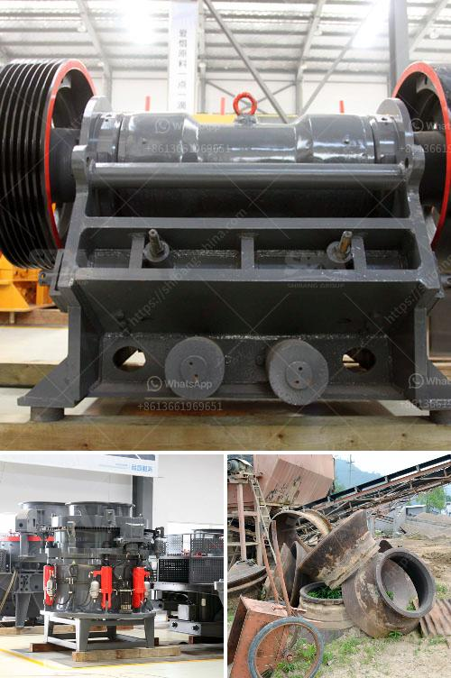

<h3>used jaw crushers canada</h3>
In the construction and mining industry, jaw crushers play a vital role in crushing and reducing large-sized rocks and ores into smaller particles for further processing. Whether it is used for quarrying, mining, or recycling, jaw crushers are an essential piece of equipment. In Canada, where various industries thrive, finding the right jaw crusher can be a challenging task. Luckily, there is an abundance of used jaw crushers available in Canada, providing a cost-effective solution for crushing needs.

One of the significant advantages of investing in used jaw crushers in Canada is that they come at a lower price compared to new crushers. The cost of a new jaw crusher could be considerably higher, making it unaffordable for some businesses, especially smaller ones. However, by opting for a used jaw crusher, companies can save a substantial amount of money without compromising on quality.

Although used, these jaw crushers are often well-maintained and in excellent condition. This is because many machines used in the mining and construction industry undergo regular maintenance and inspections to ensure they remain in optimal working condition. So, businesses can expect these used crushers to deliver the same performance and productivity as new ones.

When searching for used jaw crushers in Canada, buyers have a wide variety of options to choose from. Different makes and models are listed on various online platforms and marketplaces that specialize in used machinery sales. By exploring these resources, buyers can find a jaw crusher that suits their specific requirements in terms of capacity, size, and features.

Moreover, buying used jaw crushers from reliable and reputable sellers ensures the equipment's reliability and longevity. Some sellers may even offer warranties or additional services to provide further peace of mind to buyers. It is crucial, however, to thoroughly inspect the equipment for any wear and tear or damage before finalizing the purchase. This can be accomplished by visiting the seller's location or arranging a video conference to inspect the equipment virtually.

In addition to the cost advantage, used jaw crushers also contribute to sustainable and environmentally friendly practices. Since these machines have already been manufactured, no additional resources or energy are expended to produce new ones. By investing in used equipment, businesses can contribute to reducing their carbon footprint and promoting a circular economy.

To conclude, used jaw crushers in Canada are a cost-effective solution for businesses in need of crushing equipment. They offer a lower price compared to new crushers without compromising on quality. With a wide range of options available, buyers can find a used jaw crusher that meets their specific requirements. It is essential to buy from reliable sellers and inspect the equipment thoroughly before making a purchase. By choosing used jaw crushers, businesses can not only save money but also contribute to sustainable practices in the construction and mining industries.
<h3>Contact us</h3><ul><li><strong>Whatsapp:&nbsp;<a href="https://wa.me/8613661969651">+8613661969651</a></strong></li><li><a href="https://swt.shibang-china.com/?git&amp;zhl&amp;used jaw crushers canada"><strong>Online Service(chat now)</strong></a></li></ul><h3>Related</h3><ul><li><a href='limestone crusher philippines.md'>limestone crusher philippines</a></li><li><a href='granite milling unit.md'>granite milling unit</a></li><li><a href='ball mill how to grind mineral.md'>ball mill how to grind mineral</a></li><li><a href='production of rock sand.md'>production of rock sand</a></li><li><a href='bentonite grinding machines price.md'>bentonite grinding machines price</a></li></ul>