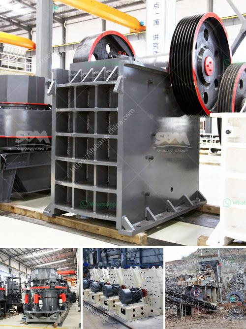

<h3>used limestone crushing equipment houston</h3>
Limestone is a sedimentary rock that has found numerous applications in construction, agriculture, and industry. With its abundance and accessibility, there is no wonder limestone has been used for thousands of years. And when it comes to crushing equipment, there are several used options to choose from. Whether you are a contractor or a project manager looking for a budget-friendly solution in Houston, used limestone crushing equipment can offer substantial savings.

In Houston, there are several reputable suppliers that provide quality used limestone crushing equipment at an affordable price. Utilizing the expertise of these suppliers, you can save a significant amount of money without compromising the efficiency and effectiveness of your operations. Used equipment has already proven its reliability and durability, and reputable suppliers ensure that the equipment is well-maintained, fully functional, and ready for use.

By opting for used limestone crushing equipment, you can benefit from reduced initial costs, lower operating expenses, and the ability to invest in other areas of your business. With cost savings, you can allocate funds towards hiring skilled employees, expanding your fleet, or investing in new technologies that can enhance overall productivity.

Additionally, used limestone crushing equipment is eco-friendly and less taxing on the environment compared to mining new limestone. By recycling equipment, you can reduce the amount of waste generated at your construction site, lessen air and water pollution caused by heavy machinery, and decrease fossil fuel consumption. This commitment to sustainability is not only beneficial to the environment but also reflects positively on your company's reputation.

Before investing in used limestone crushing equipment, it is important to conduct thorough research and choose a reliable supplier that offers quality machinery. You should inspect the equipment yourself or hire a professional to ensure all components are in good working condition. This will help you avoid any unexpected breakdowns or costly repairs in the future.

In conclusion, used limestone crushing equipment can be an affordable option for many businesses in Houston. By choosing this option, you can save money, promote sustainability, and maintain the efficiency of your operations. Remember to do your due diligence in selecting a reputable supplier to ensure you are making a wise investment.
<h3>Contact us</h3><ul><li><strong>Whatsapp:&nbsp;<a href="https://wa.me/8613661969651">+8613661969651</a></strong></li><li><a href="https://swt.shibang-china.com/?git&amp;zhl&amp;used limestone crushing equipment houston"><strong>Online Service(chat now)</strong></a></li></ul><h3>Related</h3><ul><li><a href='100tph stone crushing and screening plant.md'>100tph stone crushing and screening plant</a></li><li><a href='crushing and screening equipment prices south africa.md'>crushing and screening equipment prices south africa</a></li><li><a href='sell mill of hammers malaysia.md'>sell mill of hammers malaysia</a></li><li><a href='granite milling unit.md'>granite milling unit</a></li><li><a href='used primary crushers for sale.md'>used primary crushers for sale</a></li></ul>