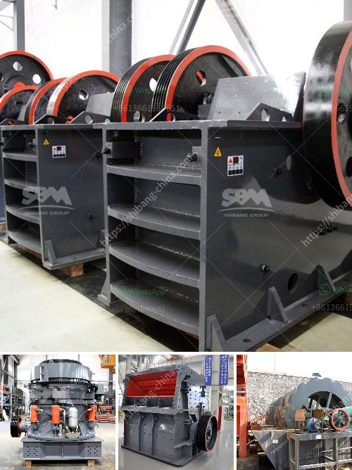

<h3>used limestone milling machine</h3>
Limestone is a sedimentary rock composed primarily of calcium carbonate with the occasional presence of magnesium. Whether in powdered or granular form, limestone has widespread applications in various industries, including construction, agriculture, and manufacturing. To process and utilize limestone efficiently, a reliable milling machine is needed.

When it comes to acquiring a used limestone milling machine, some might easily dismiss the idea, assuming it to be a subpar alternative to a brand-new counterpart. However, this couldn't be further from the truth. Used limestone milling machines offer an excellent solution for businesses looking to minimize costs while maintaining quality output. In this article, we will explore the advantages and considerations of purchasing a used limestone milling machine.

Cost Effectiveness: The primary advantage of buying used machinery, like a limestone milling machine, is the cost savings it offers. Compared to purchasing a new machine, used machinery is often available at a fraction of the original price, making it ideal for businesses operating on a tight budget. This cost effectiveness allows companies to reallocate funds towards other crucial aspects of their operations, such as expansion, research and development, or workforce development.

Dependable Performance: Many used limestone milling machines are still in excellent working condition, having been well-maintained by previous owners. These machines may have been replaced due to industry advancements, changes in production requirements, or other external factors entirely unrelated to their functionality. As a result, purchasing a used limestone milling machine does not necessarily equate to compromising on quality or performance. By conducting thorough inspections and verifying the machine's maintenance history, buyers can secure a reliable and efficient piece of equipment.

Immediate Availability: Time is of the essence when it comes to acquiring machinery for business operations. Choosing a used limestone milling machine means that it is typically available for purchase immediately. Unlike the lead time often associated with new machine orders, obtaining a used machine can substantially cut down on waiting times, allowing businesses to get up and running more quickly.

Reduced Downtime: Another noteworthy advantage of opting for a used limestone milling machine is the potential for reduced downtime. In industries that rely heavily on continuous production, even a brief interruption can be costly. By purchasing a used machine, businesses can quickly replace or supplement their existing equipment to maintain production levels without extensive downtime. This ensures that operations continue smoothly, minimizing potential losses or delays.

Environmental Sustainability: Choosing a used limestone milling machine aligns with sustainable practices by giving a second life to existing equipment. Extending the lifespan of machinery helps reduce the overall carbon footprint associated with their manufacturing, transportation, and disposal. As companies worldwide strive to adopt more eco-friendly approaches, purchasing used machinery is a practical step towards embracing sustainability.

In conclusion, buying a used limestone milling machine offers a practical and cost-effective solution for businesses operating in industries that rely on limestone. By reaping the benefits of cost effectiveness, dependable performance, immediate availability, reduced downtime, and environmental sustainability, companies can maximize their efficiency while keeping their expenses in check. With thorough equipment inspections and proper due diligence, acquiring a used limestone milling machine can be a smart investment that contributes to long-term profitability and success.
<h3>Contact us</h3><ul><li><strong>Whatsapp:&nbsp;<a href="https://wa.me/8613661969651">+8613661969651</a></strong></li><li><a href="https://swt.shibang-china.com/?git&amp;zhl&amp;used limestone milling machine"><strong>Online Service(chat now)</strong></a></li></ul><h3>Related</h3><ul><li><a href='blands of quarry crusher plant ball mill.md'>blands of quarry crusher plant ball mill</a></li><li><a href='how to set up crusher.md'>how to set up crusher</a></li><li><a href='china granite jaw crusher.md'>china granite jaw crusher</a></li><li><a href='coal pulverizer types.md'>coal pulverizer types</a></li><li><a href='iron ore cruseher plant price.md'>iron ore cruseher plant price</a></li></ul>