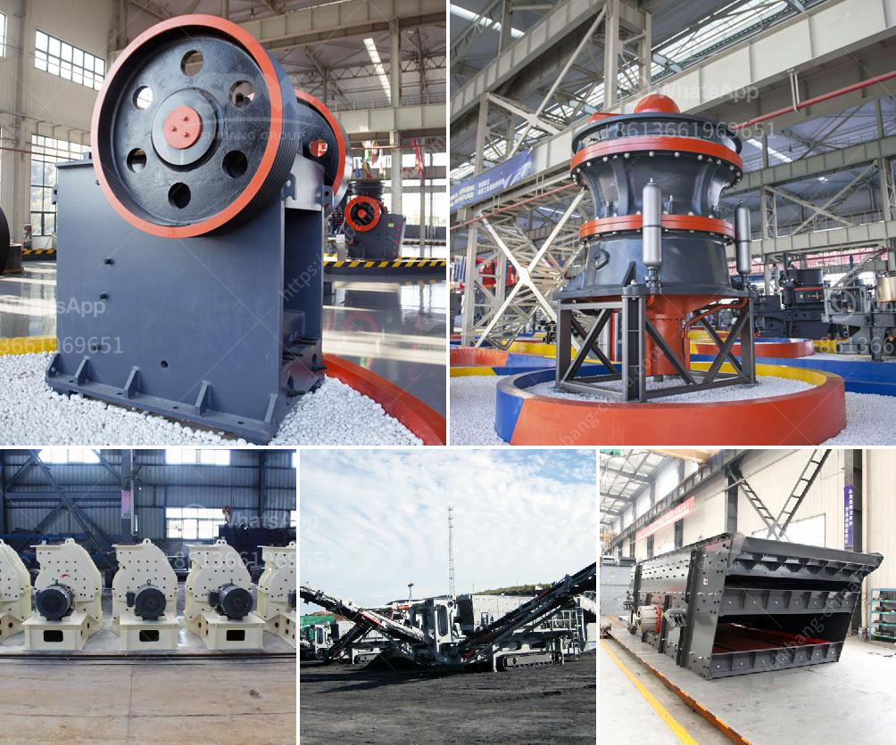

<h3>used machines from china</h3>
In today's competitive business landscape, companies are constantly seeking ways to reduce costs, increase productivity, and improve efficiency. And when it comes to purchasing machinery, opting for used machines from China can be a game-changer. 

China, known for its vast manufacturing capabilities and technological advancements, has become a go-to destination for businesses around the world. The country's well-developed machinery manufacturing industry offers a wide range of used machines, from construction and agriculture to textiles and electronics.

One of the major advantages of buying used machines from China is cost savings. These machines are often priced significantly lower than brand new ones, allowing businesses to acquire high-quality equipment at a fraction of the original price. Additionally, many Chinese manufacturers provide warranties and maintenance services for used machinery, further reducing the potential risks involved in the purchase.

Furthermore, China's reputation for technological prowess ensures that used machines from this country are often equipped with advanced features and capabilities. These machines can still provide excellent performance and durability, meeting the demands of various industries worldwide. With proper maintenance and servicing, these used machines can be relied upon for several years, making them a cost-effective investment for businesses.

However, it is essential for buyers to conduct thorough research and due diligence before purchasing used machines from China. Ensuring that the supplier has a good track record, substantial experience, and positive customer reviews is crucial. Furthermore, buyers should inspect the machines and test their functionality before finalizing the purchase.

In conclusion, buying used machines from China offers a cost-effective solution for businesses seeking to optimize their operations. The combination of lower prices, advanced technology, and reliable performance makes it an attractive option for various industries. By taking the necessary precautions and choosing reputable suppliers, businesses can benefit from high-quality machinery without breaking the bank.
<h3>Contact us</h3><ul><li><strong>Whatsapp:&nbsp;<a href="https://wa.me/8613661969651">+8613661969651</a></strong></li><li><a href="https://swt.shibang-china.com/?git&amp;zhl&amp;used machines from china"><strong>Online Service(chat now)</strong></a></li></ul><h3>Related</h3><ul><li><a href='blake jaw crusher.md'>blake jaw crusher</a></li><li><a href='zhauns south africa price list pdf.md'>zhauns south africa price list pdf</a></li><li><a href='quote for cone crusher.md'>quote for cone crusher</a></li><li><a href='quartz powder manufacturers manufacturers in china.md'>quartz powder manufacturers manufacturers in china</a></li><li><a href='iron ore processing machine for sale.md'>iron ore processing machine for sale</a></li></ul>