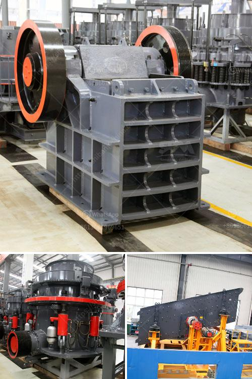

<h3>used metal crushers japan</h3>
Japan has long been regarded as one of the most environmentally conscious countries in the world. With limited land resources and a high population density, recycling has become a crucial aspect of their waste management strategies. One particular area where Japan has excelled in recycling is the metal industry, and used metal crushers have played a significant role in this process.

Metal recycling has numerous environmental and economic benefits. It reduces the need for virgin metals, conserves natural resources, and minimizes greenhouse gas emissions associated with metal production. In addition, recycling metals saves a significant amount of energy compared to producing new metals from ores. Japan, recognizing these advantages, has focused on developing an efficient and sustainable metal recycling industry.

One of the key components of this industry is the use of used metal crushers. These machines are designed to transform large, bulky metal items into smaller, more manageable pieces. Metal crushers can handle various types of metal waste, including steel, aluminum, copper, and more. They assist in the compaction and processing of metal scrap, making it easier to transport and recycle.

Used metal crushers in Japan come in various sizes and configurations to suit different recycling needs. Some crushers are mobile and can be easily transported to the site of metal scrap collection, while others are stationary and are installed at recycling facilities. The crushers employ different mechanisms to crush the metal waste, such as hydraulic presses and rotating blades.

Japan's metal crushers industry is largely driven by the demand for shredded metal scrap from steel mills and foundries. These end-users require clean, high-quality scrap to produce new metal products. By using metal crushers, recycling companies can efficiently process and deliver scrap that meets the specifications of these consumers.

The quality and purity of the shredded metal also determine its value in the market. Therefore, metal crushers in Japan are engineered to produce uniform and contaminant-free scrap. The machines incorporate advanced technologies to separate non-metallic materials, such as rubber and plastic, from the metal waste. This ensures that the recycled metal maintains its integrity and can be reused without compromising the finished products' quality.

Metal crushers in Japan are subject to strict regulations to ensure environmental safety. The government has established guidelines for noise reduction, dust suppression, and waste disposal. Recycling facilities must adhere to these guidelines to obtain operating permits. Environmental audits and regular inspections are conducted to monitor compliance and prevent any adverse impact on the environment.

In conclusion, used metal crushers have become an indispensable component of Japan's metal recycling industry. These machines help transform bulky metal waste into smaller pieces, making it more manageable for transportation and recycling. The crushers produce high-quality, contaminant-free scrap that is in high demand by steel mills and foundries. By investing in metal crushers and adhering to strict regulations, Japan has achieved remarkable success in promoting a sustainable and efficient metal recycling ecosystem.
<h3>Contact us</h3><ul><li><strong>Whatsapp:&nbsp;<a href="https://wa.me/8613661969651">+8613661969651</a></strong></li><li><a href="https://swt.shibang-china.com/?git&amp;zhl&amp;used metal crushers japan"><strong>Online Service(chat now)</strong></a></li></ul><h3>Related</h3><ul><li><a href='stone conveyor belt design manual pdf.md'>stone conveyor belt design manual pdf</a></li><li><a href='gypsum factory machines in india.md'>gypsum factory machines in india</a></li><li><a href='vertical vertical raw mill.md'>vertical vertical raw mill</a></li><li><a href='granite quarry machinery for sale.md'>granite quarry machinery for sale</a></li><li><a href='cement clinker grinding and packing plant.md'>cement clinker grinding and packing plant</a></li></ul>