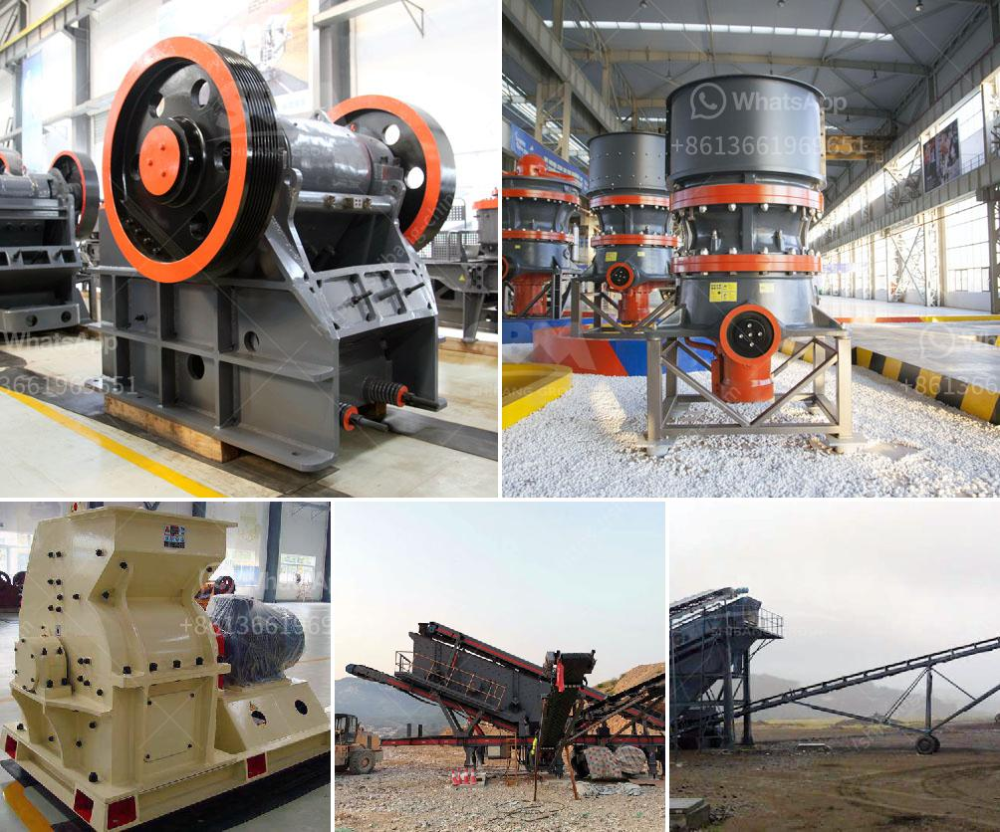

<h3>used mobile crushers for sale south africa</h3>
If you are in the market for a used mobile crusher, you should consider buying one from South Africa. South Africa is known as the Rainbow Nation, a land of diverse cultures and traditions. From a bustling metropolis like Johannesburg to the stunning landscapes of Cape Town, South Africa is a country rich in natural resources and has a thriving economy. As a result, it offers numerous options for buying used mobile crushers, making it an attractive destination for those in the market.

One of the biggest advantages of buying used mobile crushers from South Africa is the affordable prices. Compared to new crushers, used ones are significantly cheaper. This makes them an excellent choice for small businesses or individuals with a limited budget. Despite being used, these crushers are in good working condition and can provide reliable performance. You can find various models of used mobile crushers for sale in South Africa, including jaw crushers, cone crushers, and impact crushers.

When it comes to used mobile crushers, South Africa has a wide range to choose from. Whether you are looking for a used mobile cone crusher, used mobile jaw crusher, or a used mobile impact crusher, South Africa has sed crushers to meet your specific requirements. We showcase a variety of used mobile crushers available for sale in South Africa. Our website makes it easy to search for the machines you need by category and location. All you have to do is browse our website for used mobile crushers and find the one that suits your needs.

Another benefit of buying used mobile crushers, especially from South Africa, is their reliability. These machines have proven their durability and efficiency over time. They have successfully completed numerous projects and are highly regarded in the industry. Even though they have been used before, they can still provide excellent performance and superior quality. This means you can expect reliable operation and long-lasting service from a used mobile crusher bought in South Africa.

If you are in the construction, mining, or recycling industries, a used mobile crusher can be a valuable addition to your fleet. It can help you increase productivity, reduce costs, and improve overall efficiency. With the right crusher, you can process various materials, such as concrete, asphalt, and limestone, with ease. This versatility makes mobile crushers a popular choice among businesses in South Africa.

In conclusion, buying used mobile crushers from South Africa offers significant advantages. The affordable prices make them accessible to small businesses and individuals on a limited budget. Despite being used, these crushers are reliable and can provide excellent performance. South Africa offers a wide range of used mobile crushers, including jaw crushers, cone crushers, and impact crushers, all available for purchase on our website. With their proven durability and efficiency, these crushers can become valuable assets for your business. Whether you are in the construction, mining, or recycling industries, consider buying used mobile crushers from South Africa to meet your specific needs.
<h3>Contact us</h3><ul><li><strong>Whatsapp:&nbsp;<a href="https://wa.me/8613661969651">+8613661969651</a></strong></li><li><a href="https://swt.shibang-china.com/?git&amp;zhl&amp;used mobile crushers for sale south africa"><strong>Online Service(chat now)</strong></a></li></ul><h3>Related</h3><ul><li><a href='aggregate processing equipment.md'>aggregate processing equipment</a></li><li><a href='granite crusher machine philippines.md'>granite crusher machine philippines</a></li><li><a href='track impact crusher.md'>track impact crusher</a></li><li><a href='coal crusher 10mm.md'>coal crusher 10mm</a></li><li><a href='dolomite stone crusher manufacturers.md'>dolomite stone crusher manufacturers</a></li></ul>