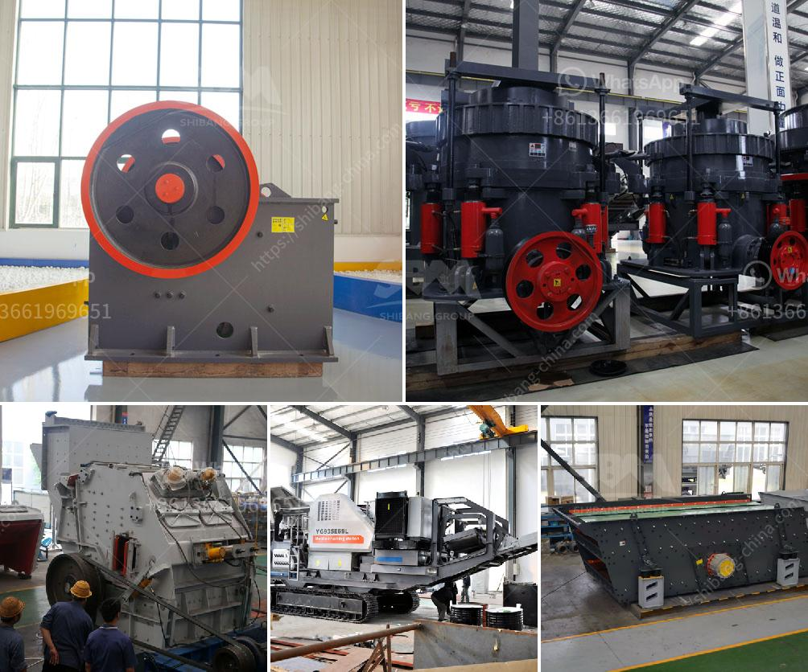

<h3>used portable rock crusher canada</h3>
Rock crushers are used for crushing rocks into small, manageable sizes. These machines are the top choice for contractors and amateur prospectors alike. Depending on the needs of the user, the rock crusher can be used to crush stones, concrete waste, and other materials. The portable design allows it to be used in any location, making it an excellent choice for construction projects or recreational activities.

Canada is known for its vast landscapes and natural resources, including an abundance of rocks. With the rise in construction projects and the need for aggregates, the demand for a reliable and efficient rock crusher is on the rise. Used portable rock crushers in Canada offer the perfect solution for contractors who need to buy a rock crusher but cannot acquire the necessary funds to invest in a brand-new machine.

Buying used rock crushers for sale in Canada is not necessarily a bad option as long as you have a basic understanding of the machine’s features and how they work. Here are some key factors to consider when browsing through listings of used crushers:

1. Condition: Always make sure to check the overall condition of the rock crusher before making a purchase. Look for signs of wear and tear, and ensure that all parts are functioning correctly. It may be helpful to ask the seller for maintenance records to ensure that the machine has been properly cared for. If possible, request a demonstration or test run to see how the crusher operates.

2. Specs: Consider the specific requirements of your project to ensure that the used rock crusher meets your needs. Pay attention to factors like crushing capacity, feeding size, and output size. It is also important to consider the power source. Some crushers run on diesel engines, while others require electricity.

3. Price: Pricing on used portable rock crushers can vary greatly depending on factors like the age and condition of the machine, the brand, and the location of the seller. However, it is generally more affordable to purchase a used rock crusher compared to a new one. Take the time to compare prices from different sellers to get the best deal.

Purchasing a used portable rock crusher in Canada can be an excellent investment for contractors and prospectors alike. These machines provide a quick and efficient way to crush rocks and produce high-quality aggregates. Additionally, their portability allows them to be used in various locations, making them a versatile tool for any construction or outdoor project.

Before making a purchase, be sure to thoroughly inspect the machine and consider factors like condition, specifications, and price. By doing so, you can find a reliable rock crusher that suits your specific needs without breaking the bank. So, if you're in the market for a rock crusher, consider buying used to save money without compromising on functionality.
<h3>Contact us</h3><ul><li><strong>Whatsapp:&nbsp;<a href="https://wa.me/8613661969651">+8613661969651</a></strong></li><li><a href="https://swt.shibang-china.com/?git&amp;zhl&amp;used portable rock crusher canada"><strong>Online Service(chat now)</strong></a></li></ul><h3>Related</h3><ul><li><a href='used track mounted stone crusher.md'>used track mounted stone crusher</a></li><li><a href='hot selling coal mine roller crushing plant in india.md'>hot selling coal mine roller crushing plant in india</a></li><li><a href='5 raymond roller mill.md'>5 raymond roller mill</a></li><li><a href='vertical conveyor for gravel transporting.md'>vertical conveyor for gravel transporting</a></li><li><a href='sand washing machine lsx920.md'>sand washing machine lsx920</a></li></ul>