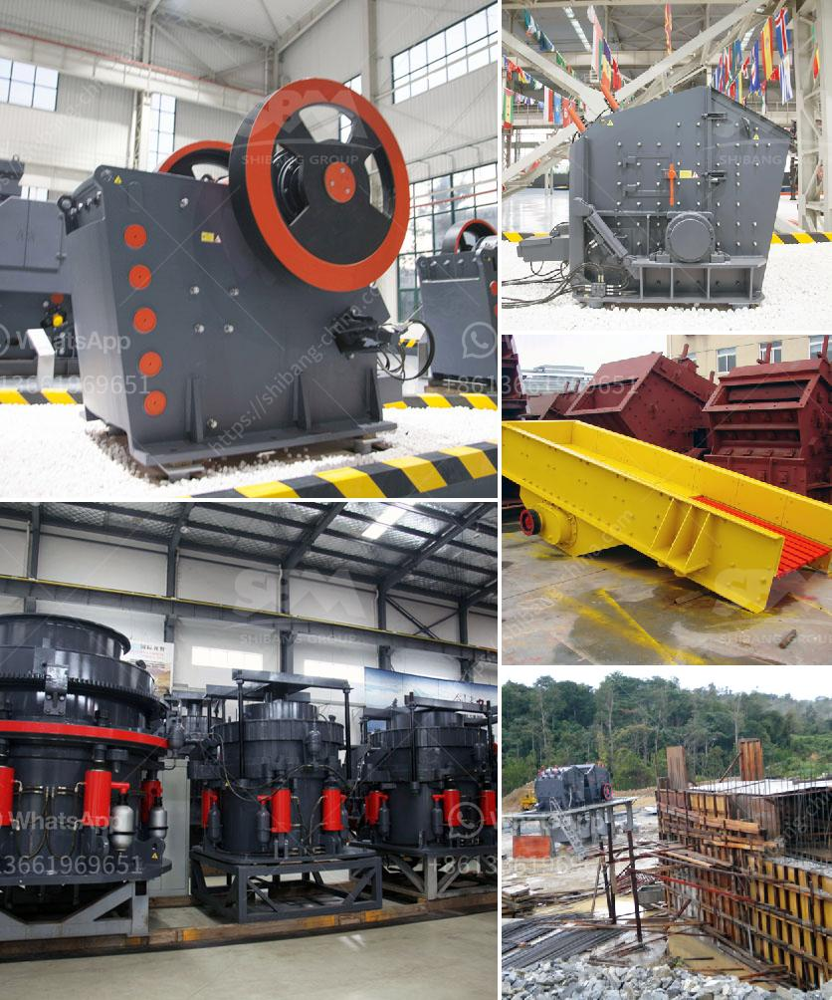

<h3>used primary crushers for sale</h3>
When it comes to finding the right primary crusher for your operation, buying a used one can often be a cost-effective solution. Used primary crushers for sale can help you meet your production needs while keeping your budget in check.

Primary crushers are the first step in the crushing process and play a crucial role in reducing large rocks into more manageable sizes for further processing. They are typically used in mining, quarrying, and recycling operations. However, buying a brand-new primary crusher can be quite expensive, especially if you are just starting out or have a limited budget.

That's where used primary crushers come in. By opting for a used one, you can save a significant amount of money while still getting a reliable and efficient machine. Many used crushers on the market are still in excellent condition and are capable of delivering the same performance as a new one.

There are several factors to consider when buying a used primary crusher. Firstly, you need to evaluate the condition of the machine and ensure it has been properly maintained. This includes inspecting its components, such as the rotor, bearings, and crushing chamber. It is advisable to hire a professional to conduct a thorough inspection before making a purchase.

Another important consideration is the capacity and specifications of the crusher. Ensure that the used primary crusher you are considering has the capacity to handle your desired production volume. Additionally, check if it meets your specific requirements in terms of the feed size and product size range.

When browsing for used primary crushers for sale, it is crucial to source from a reputable seller. Buying from a trusted dealer or seller increases the chances of getting a quality machine and ensures that you have access to customer support if needed. Furthermore, they may offer warranty options that can provide further peace of mind.

In conclusion, opting for used primary crushers for sale can be a wise decision for cost-conscious buyers. As long as you thoroughly inspect the machine, choose the right specifications, and buy from a reputable seller, you can find a reliable and efficient primary crusher that fits your budget and requirements.
<h3>Contact us</h3><ul><li><strong>Whatsapp:&nbsp;<a href="https://wa.me/8613661969651">+8613661969651</a></strong></li><li><a href="https://swt.shibang-china.com/?git&amp;zhl&amp;used primary crushers for sale"><strong>Online Service(chat now)</strong></a></li></ul><h3>Related</h3><ul><li><a href='ballast crushers in kenya.md'>ballast crushers in kenya</a></li><li><a href='used limestone milling machine.md'>used limestone milling machine</a></li><li><a href='crusher in ethiopia.md'>crusher in ethiopia</a></li><li><a href='vsi crusher suppliers in europe.md'>vsi crusher suppliers in europe</a></li><li><a href='one ton per hour crushing mill.md'>one ton per hour crushing mill</a></li></ul>