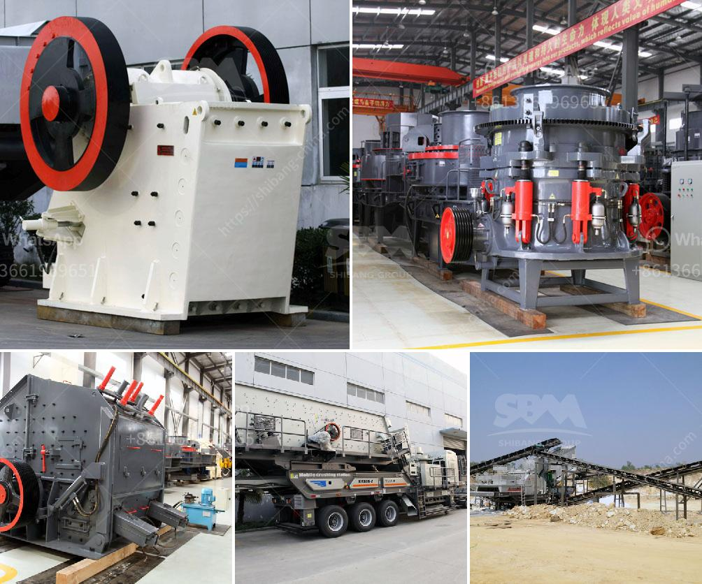

<h3>used sand washing machine for sale</h3>
Are you in need of a used sand washing machine? Maybe you're a construction company looking to expand your fleet of equipment, or perhaps you're a homeowner who wants to upgrade their existing machine. Whatever the case may be, there are plenty of options available for you to find the perfect used sand washing machine for sale. 

One of the first places to start your search is online. With the power of the internet at our fingertips, it's easier than ever to find a wide range of used sand washing machines for sale. Numerous websites and marketplaces specialize in connecting buyers and sellers of used equipment, making it convenient for you to browse through listings and compare prices.

When looking for a used sand washing machine, it's important to consider the capacity and power requirements that will suit your needs. Depending on the scale of your operations, you may need a machine that can handle larger volumes of sand or one that operates at a higher power level. Checking the specifications of each machine is crucial in ensuring its suitability for your specific requirements.

Additionally, it's recommended to opt for a trusted seller or dealer when purchasing a used sand washing machine. You want to ensure you are getting a quality machine that is in good working condition. Check the seller's reputation, read reviews, and if possible, visit the machine in person to inspect it before finalizing the purchase.

While a new sand washing machine can cost a significant amount of money, buying used can save you a substantial amount. However, it's essential to strike the right balance between quality and price. Although a used machine may be more affordable, make sure to thoroughly assess its condition to avoid unnecessary expenses in repairs or replacements down the line.

In conclusion, finding a used sand washing machine for sale is relatively easy these days, thanks to the internet and various marketplace platforms. Take your time to research and compare different options before making a decision. Look for a machine that matches your capacity and power requirements, ensure the seller is reputable, and carefully evaluate the condition of the machine. By doing so, you can find the perfect used sand washing machine that meets your needs and offers value for your money.
<h3>Contact us</h3><ul><li><strong>Whatsapp:&nbsp;<a href="https://wa.me/8613661969651">+8613661969651</a></strong></li><li><a href="https://swt.shibang-china.com/?git&amp;zhl&amp;used sand washing machine for sale"><strong>Online Service(chat now)</strong></a></li></ul><h3>Related</h3><ul><li><a href='ballast crusher price in kenya.md'>ballast crusher price in kenya</a></li><li><a href='clinker grinding plant.md'>clinker grinding plant</a></li><li><a href='costs of calcium carbonate making machinery in japan.md'>costs of calcium carbonate making machinery in japan</a></li><li><a href='list of quarry company in the philippines.md'>list of quarry company in the philippines</a></li><li><a href='trackmounted crushing.md'>track-mounted crushing</a></li></ul>