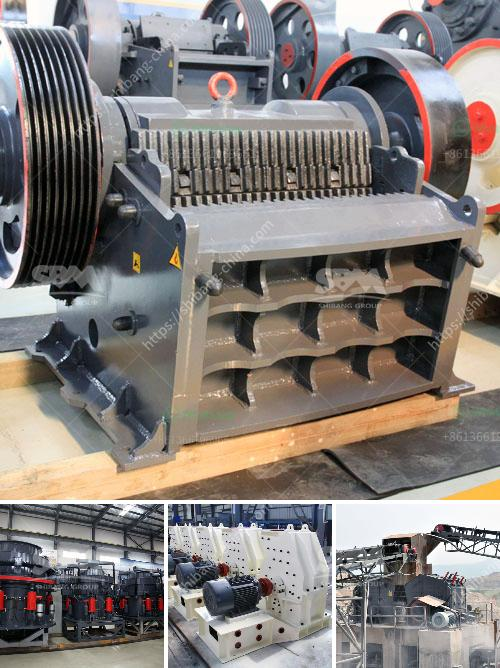

<h3>used stone crusher machine for sale in philippines</h3>
With the Southeast Asian economic takeoff, the Philippines is also very rapid economic development. Crusher, milling machines, excavators and other heavy machinery are widely used in mining, industry, water conservancy, bridge and other industries. The market prospect of mining machinery is quite optimistic. The competition in the mining industry is more intense. In order to survive in the competition, people generally pursue higher efficiency, lower energy consumption, and more environment-friendly mining industry over the world. Hence, to solve these four problems, the used stone crusher machine price became the main equipment in the sand making industry in the Philippines.

Good quality equipment is simply not enough. Used Stone Crushing Machine: No matter the used stone crushing machine used in ore mining process site or the new one, it can process the materials into small size for the next production requirements. For the used stone crushing machine, we can find that it can be divided into jaw crusher machine, cone crusher machine and impact crusher machine according to the main crushing working equipment. These machines from XSM are welcomed by the worldwide clients.

Professionals in Philippines provide customers with mining crushing machine, thin iron crusher, crushing machine for metals with the best technical support and excellent after-sales service.

Zenith is a professional manufacturer of mining equipment,cost-effective integrated crushing machine supplier,we can provide you our high quality machines for your any stone mining applications.

In India; Granite Stone Crushing Plant; Stone Quarrying Process Line; XZM Ultrafine Mill in IN Zenith Stone Crusher in Angola XZM221 ultrafine mill in Egypt Zenith Screening Plant in Palestine Peru 60-80 tph Stone Production Line Quarrying Companies In The Philippines | Quarrying Companies Quarrying Companies In The Philippines | Quarrying Companies With all the legal and political issues attached to it, the Bureau of Quarries and Geosciences (BQI) had... quarrying companies in ethiopia in philippines

Zenith is a professional manufacturer of mining equipment, which includes stone crusher, Grinding Mill, beneficiation machine, and other associated machines

Stone crusher Philippines or rock crusher Philippines can produce 40-500 tons per hour and can crush 8 ... to sale used philippines cone crusher  - 2 days ago used ...  Click & Chat Now

Shanghai Zenith Crusher Manila Office, 马尼拉. 374 likes. ZENITH is one of the biggest manufacturer in crushing and grinding industry in China. ZENITH was founded...

Rock crushing plant price in the philippines – YouTube Stone crusher in the Philippines Zenith Crusher Machine ...

ZENITH crusher: About Zenith chinese manufacturer of crushers, grinders and screening equipment for the quarry and mining industry. quarrying in Philippines |... quarrying in the zambales - Stone Crusher The Port of Subic, Subic ... process . rock quarries in luzon A QUARRY site at the slope of Mount Banahaw in... Callao Cave - Wikipedia, the free encyclopedia Callao Cave is a cave in Peñablanca, Cagayan, Philippines...

Keywords: used stone crusher machine for sale in philippines, stone crusher machine, mobile crushing plant for sale, tracked crusher for sale, crushing industry 
<h3>Contact us</h3><ul><li><strong>Whatsapp:&nbsp;<a href="https://wa.me/8613661969651">+8613661969651</a></strong></li><li><a href="https://swt.shibang-china.com/?git&amp;zhl&amp;used stone crusher machine for sale in philippines"><strong>Online Service(chat now)</strong></a></li></ul><h3>Related</h3><ul><li><a href='jaw crusher moby 600.md'>jaw crusher moby 600</a></li><li><a href='used limestone crushing equipment houston.md'>used limestone crushing equipment houston</a></li><li><a href='production of calcium carbonate from limestone.md'>production of calcium carbonate from limestone</a></li><li><a href='turkey of gold refinery project cost.md'>turkey of gold refinery project cost</a></li><li><a href='cone crusher middle east.md'>cone crusher middle east</a></li></ul>