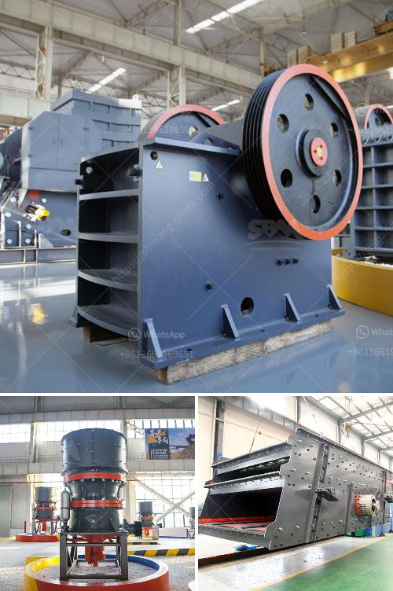

<h3>used stone crushers in south korea</h3>
Stone crushers are widely used in mining, metallurgy, building materials, highways, railways, water conservancy and chemical industries. And CHAENG is a famous foundry factory in Henan Province, which has rich experience in providing custom-made mechanical parts for the mining industry, building materials industry, metallurgical industry, construction industry, and other fields. The company mainly produces various types of crushing equipment, such as jaw crushers, impact crushers, cone crushers, hammer crushers, and roller crushers.

South Korea is known for its granite production. There are many granite quarries in South Korea. These are mainly produced in Gangwon Province, Gyeonggi Province, and Jeollanam-do Province. Granite stone is an important construction material in South Korea, and the market demand is very high.

Used stone crushers are exported to many countries and regions, such as India, Pakistan, Indonesia, Nigeria, etc. The South Korea market has experienced rapid growth in recent years, which is largely driven by the rapid growth of the construction industry. South Korea is also the largest market for CHAENG in Asia.

There are many advantages of using stone crushers in South Korea. Firstly, it is cost-effective. Stone crushers have a wide range of applications and can process materials with different hardness, sizes, and types, which can meet the requirements of different construction projects. Compared with other crushing equipment, stone crushers have low operating costs and low investment costs, which can bring greater economic benefits to users.

Secondly, stone crushers in South Korea have high efficiency. Compared with traditional crushing equipment, stone crushers have higher crushing efficiency, which can effectively improve the processing capacity of stone crushers and reduce the production cost of users. In addition, stone crushers have the advantages of uniform particle size, firm structure, stable operation, and convenient maintenance.

Thirdly, stone crushers in South Korea have good environmental performance. Stone crushers are equipped with various noise reduction and dust removal devices, which can effectively reduce noise pollution and dust pollution during the operation of stone crushers. This not only protects the health of workers but also benefits the environment.

In conclusion, stone crushers in South Korea have many advantages, such as cost-effectiveness, high efficiency, and good environmental performance. The market demand for stone crushers in South Korea is very large, and CHAENG is a famous foundry factory in South Korea, providing high-quality customized mechanical parts for the mining industry, building materials industry, metallurgical industry, construction industry, and other fields. If you are interested in stone crushers or have any needs, please feel free to contact CHAENG.
<h3>Contact us</h3><ul><li><strong>Whatsapp:&nbsp;<a href="https://wa.me/8613661969651">+8613661969651</a></strong></li><li><a href="https://swt.shibang-china.com/?git&amp;zhl&amp;used stone crushers in south korea"><strong>Online Service(chat now)</strong></a></li></ul><h3>Related</h3><ul><li><a href='salary of crusher operer in philippines.md'>salary of crusher operer in philippines</a></li><li><a href='hammer mill crusher batubara.md'>hammer mill crusher batubara</a></li><li><a href='quartz powder manufacturing equipments.md'>quartz powder manufacturing equipments</a></li><li><a href='iron ore crusher cost.md'>iron ore crusher cost</a></li><li><a href='dolomite lime process for agriculure.md'>dolomite lime process for agriculure</a></li></ul>