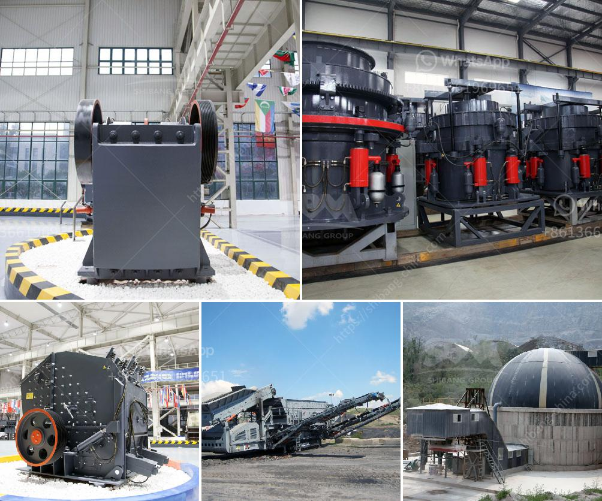

<h3>used track mounted stone crusher</h3>
Stone crushing industry is booming these days. There are numerous individuals and companies that rely on this machinery for their projects. Whether it is a construction company or a quarry, you can guarantee that they will have a track mounted stone crusher plant to use.

Crushing companies in the industry tend to work with a higher volume of material that result in the generation of large amounts of waste material. This waste can be effectively handled with a track mounted stone crusher, reducing the overall cost of production.

In the past, when the construction industry was not as developed, track mounted stone crushers were very common. These machines were featured with mobility and flexibility, allowing them to be easily moved to the construction site. This mobility was a great advantage as it saved time and increased productivity.

However, as technology advanced, and the construction industry started to grow, the focus shifted away from track mounted stone crushers. Instead, construction companies started using traditional stone crushers. This was mainly due to the fact that traditional crushers were cheaper, and they also provided a higher capacity.

But, as the demand for crushed stones continued to grow, the drawbacks of using traditional stone crushers became more apparent. The chief disadvantage was the low mobility of these machines. With traditional stone crushers, the operations were limited to one location. This meant that the stones had to be transported back and forth, increasing transportation costs.

Today, the trend is shifting back to track mounted stone crushers. They offer mobility and flexibility that traditional stone crushers simply cannot match. Also, they release fewer pollutants into the environment, reducing their carbon footprint.

With technological advancements, these track mounted stone crushers are equipped with various features that are not present in traditional stone crushers. They are designed to be easy to operate, making maintenance and repairs simpler. The new models also come with intelligent control systems, allowing operators to adjust the machine's parameters to optimize production.

Additionally, track mounted stone crushers are now available with wireless remote control operation, improving productivity and reducing downtime. This feature allows operators to move the machine from one location to another without the need to physically be on-site.

Furthermore, these machines are equipped with high-quality components that ensure durability and longevity. With proper maintenance, they can last for years without major breakdowns, reducing overall operational costs.

Overall, investing in a used track mounted stone crusher is a great way to increase productivity and save on transportation costs. These machines are flexible, eco-friendly, and highly efficient. With the right project scope and budget, a track mounted stone crusher can bring you tons of benefits.

In conclusion, considering the benefits mentioned above and the increasing demand for crushed stones, it is safe to say that investing in a used track mounted stone crusher will be a smart move for any construction company or quarry owner.
<h3>Contact us</h3><ul><li><strong>Whatsapp:&nbsp;<a href="https://wa.me/8613661969651">+8613661969651</a></strong></li><li><a href="https://swt.shibang-china.com/?git&amp;zhl&amp;used track mounted stone crusher"><strong>Online Service(chat now)</strong></a></li></ul><h3>Related</h3><ul><li><a href='beneficiation plant for feldspar japan.md'>beneficiation plant for feldspar japan</a></li><li><a href='gold stamp mill for sale zim price.md'>gold stamp mill for sale zim price</a></li><li><a href='equipment used in iron ore beneficiation.md'>equipment used in iron ore beneficiation</a></li><li><a href='bentonite production plant machinery.md'>bentonite production plant machinery</a></li><li><a href='stone crusher mobile plant south africa.md'>stone crusher mobile plant south africa</a></li></ul>