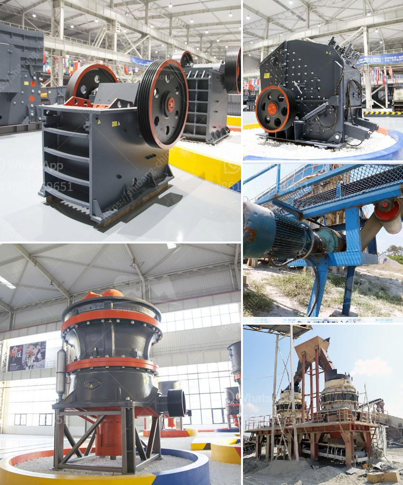

<h3>used vertical grinding machine</h3>
In the field of precision grinding, vertical grinding machines have always been a preferred choice. These machines provide maximum precision and accuracy while minimizing the time and effort required for the task. For many, purchasing a brand new vertical grinding machine might not be financially feasible. This is where used vertical grinding machines come into play, offering an affordable solution for precision grinding.

Used vertical grinding machines are a cost-effective option for manufacturers looking to improve their production processes without investing heavily in new equipment. They offer the same high-quality results as new machines but at a fraction of the price. These machines are sourced from reputable sellers, ensuring that they are in good working condition and have been properly maintained.

One of the advantages of used vertical grinding machines is that they often come with a complete history of maintenance and repairs. This allows buyers to make an informed decision about the machine's performance and reliability. Additionally, reputable sellers will often provide warranties and technical support to ensure that customers are satisfied with their purchase in the long run.

Used vertical grinding machines are available in a wide range of models and specifications, catering to the diverse needs of industries such as automotive, aerospace, and manufacturing. Whether it is surface grinding, rotary grinding, or any other precision grinding task, there is a used machine available to suit every requirement.

Investing in a used vertical grinding machine brings several benefits to manufacturers. Firstly, it helps them save money, which can then be reinvested in other aspects of the business. Secondly, it reduces lead times by eliminating the wait for a new machine to be manufactured and delivered. This can be crucial for manufacturers who need immediate access to precision grinding solutions to meet customer demands.

Moreover, used vertical grinding machines are known for their durability and robustness. Even when purchased second-hand, these machines are built to withstand heavy-duty use and provide years of reliable service. Therefore, buyers can expect to get a good return on their investment and continue to benefit from the machine's capabilities for a long time.

It is worth mentioning that purchasing a used vertical grinding machine does not mean compromising on quality or precision. These machines are designed to meet the highest standards of accuracy and performance. Additionally, they can be easily retrofitted or upgraded with the latest technology to enhance their capabilities, further increasing their value and productivity.

In conclusion, used vertical grinding machines offer a cost-effective solution for precision grinding tasks. They provide the same level of accuracy and quality as new machines, ensuring that manufacturers can achieve the desired results without breaking the bank. With a wide range of models available and warranties provided by reputable sellers, investing in a used vertical grinding machine is a decision that manufacturers can confidently make.
<h3>Contact us</h3><ul><li><strong>Whatsapp:&nbsp;<a href="https://wa.me/8613661969651">+8613661969651</a></strong></li><li><a href="https://swt.shibang-china.com/?git&amp;zhl&amp;used vertical grinding machine"><strong>Online Service(chat now)</strong></a></li></ul><h3>Related</h3><ul><li><a href='grinding mills jalandhar.md'>grinding mills jalandhar</a></li><li><a href='plant of bentonite crusher.md'>plant of bentonite crusher</a></li><li><a href='hammer grinding mill crusher 10tonnes per hour.md'>hammer grinding mill crusher 10tonnes per hour</a></li><li><a href='jaw crusher machine construction diagram.md'>jaw crusher machine construction diagram</a></li><li><a href='how to make copper concentrate.md'>how to make copper concentrate</a></li></ul>