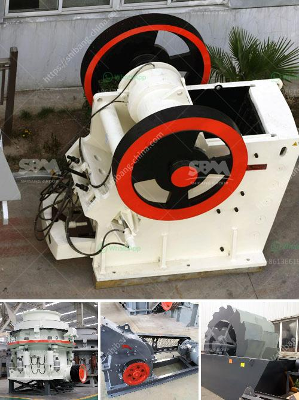

<h3>usinas de asfalto para venda em angola</h3>
Angola é um país localizado na costa ocidental da África, conhecido por sua rica indústria petrolífera e suas belas praias. No entanto, embora o país tenha uma infraestrutura básica de transporte, ainda há muito a ser feito para melhorar e expandir suas estradas e rodovias.

Uma das maneiras mais eficientes de melhorar a infraestrutura viária de Angola é investir em usinas de asfalto. Essas usinas são responsáveis pela produção do asfalto, que é utilizado na construção e manutenção de estradas. Com uma usina de asfalto em Angola, seria possível produzir esse material localmente, reduzindo custos e aumentando a velocidade de construção de novas estradas.

Uma das principais vantagens de investir em usinas de asfalto em Angola é a autonomia na produção do asfalto. Atualmente, o asfalto é importado de outros países, o que aumenta os custos e dificulta a rápida expansão viária. Com uma usina de asfalto local, seria possível produzir o material internamente, reduzindo os custos de importação e acelerando a construção de novas estradas.

Além disso, a produção local de asfalto poderia melhorar a qualidade das estradas em Angola. O asfalto importado pode enfrentar problemas de qualidade devido ao transporte e armazenamento inadequados. Com uma usina de asfalto local, seria possível controlar diretamente a qualidade do material produzido, garantindo que as estradas de Angola sejam construídas com um asfalto durável e resistente, capaz de suportar as condições climáticas e o tráfego intenso.

Outro benefício de investir em usinas de asfalto em Angola é o potencial de geração de empregos. A construção e operação de usinas de asfalto exigiriam mão de obra local qualificada, criando oportunidades de emprego para os angolanos. Além disso, as novas estradas construídas com o asfalto produzido localmente também estimulariam o desenvolvimento econômico e o turismo, criando ainda mais empregos nas áreas vizinhas.

No entanto, apesar dos benefícios claros, também existem desafios a serem superados para implementar usinas de asfalto em Angola. Um dos principais desafios é o investimento inicial necessário para estabelecer a usina. As usinas de asfalto são equipamentos complexos e caros, exigindo um investimento significativo para adquirir e operar. Portanto, seria necessário atrair o investimento tanto do governo quanto do setor privado para tornar esse projeto viável.

Além disso, a falta de expertise e conhecimento técnico local pode ser outra barreira para a implementação de usinas de asfalto em Angola. Seria necessário treinar e capacitar engenheiros e trabalhadores locais para operar e manter essas usinas de forma eficiente.

Em conclusão, investir em usinas de asfalto para venda em Angola poderia ser uma solução eficaz para melhorar a infraestrutura viária do país. Com a produção local de asfalto, seria possível reduzir os custos, melhorar a qualidade das estradas e gerar empregos. No entanto, são necessários investimentos significativos e o desenvolvimento de conhecimentos técnicos locais para implementar esse projeto com sucesso.
<h3>Contact us</h3><ul><li><strong>Whatsapp:&nbsp;<a href="https://wa.me/8613661969651">+8613661969651</a></strong></li><li><a href="https://swt.shibang-china.com/?git&amp;zhl&amp;usinas de asfalto para venda em angola"><strong>Online Service(chat now)</strong></a></li></ul><h3>Related</h3><ul><li><a href='trackmounted crushing.md'>track-mounted crushing</a></li><li><a href='iron processing machine price.md'>iron processing machine price</a></li><li><a href='hammer mills for sale in south africa.md'>hammer mills for sale in south africa</a></li><li><a href='jaw crusher for hire south africa for limestone.md'>jaw crusher for hire south africa for limestone</a></li><li><a href='gypsum crusher in salalah oman.md'>gypsum crusher in salalah oman</a></li></ul>